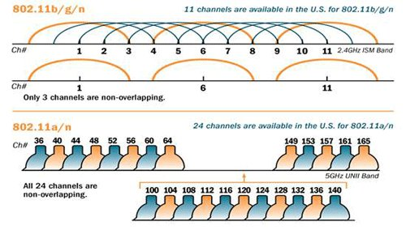

# Wi‑Fi Foundations

---

Wi-Fi is a family of wireless network protocols based on the IEEE 802.11 family of standards, which are commonly used for local area networking of devices and Internet access. Wi-Fi works as shared medium, where multiple devices can communicate over the same radio frequency. 

## Wifi Base Concepts

### Reliability and Errors

On a wire, bits usually arrive with very low error rates (unless something is broken).
Over the air, packets can get corrupted or lost because of:

- Interference (other Wi-Fi networks, Bluetooth, microwave ovens)
- Weak signal / obstacles such as walls
- Multipath (reflections causing fading)
- Antenna orientation

### Shared Medium and Contention

Wi-Fi is a shared medium, so devices must coordinate access to avoid collisions. This is done using a protocol called **CSMA/CA** (Carrier Sense Multiple Access with Collision Avoidance):

1. Listen before talk: devices check if the channel is clear before transmitting.
2. If idle, they transmit. 
3. If the channel is busy, they wait for a random backoff time before trying again
4. If the sender does not receive an ACK, it assumes the frame was lost (collision/interference) and retries after backoff.

This means that latency can be variable, especially in crowded environments, and throughput can decrease as more devices compete for the same channel.

Wi-Fi transmissions expect acknowledgments (ACKs) to confirm successful delivery. If an ACK is not received, the sender will retry the transmission, which can further increase latency.

### Speed

Wi-Fi speeds can vary widely based on the standard (e.g., 802.11n, 802.11ac, 802.11ax), signal strength, interference, and the number of devices sharing the network. We have the PHYSICAL data rate (e.g., 300 Mbps) which comes from the modulation scheme and channel width, and the ACTUAL throughput (e.g., 100 Mbps) which is what applications experience after accounting for protocol overhead, retransmissions, and contention.

### Architectures

- **Infrastructure mode:** devices connect to an AP (access point) which manages the network. This is the most common setup for home and office Wi-Fi.


- **Ad-hoc mode:** devices connect directly to each other without an AP. This is less common and typically used for specific applications like device-to-device communication.
- **Mesh networks:** multiple APs work together to provide seamless coverage over a larger area. Devices can connect to the nearest AP, and the APs communicate with each other to route traffic.

## Wi-Fi Stack

A stack is a set of software layers that work together to implement a network protocol. The Wi-Fi stack has several layers.


### 1) Wi-Fi radio (L1) + 802.11 (PHY/MAC) (L2)

This is the “over-the-air” part.

**PHY (Physical Layer):**

- Converts bits ↔ radio waves
- Chooses modulation/coding rate (it adapts based on link quality)
- Deals with channel width, frequency band, signal strength, noise

??? Glossary
    - **Modulation:** how bits are represented as changes in the radio signal 
    - **Coding rate:** how much error correction is used (e.g., 1/2, 3/4), A 3/4 coding rate means that for every 4 bits sent, 3 are data and 1 is error correction. Higher coding rates (like 5/6) have less error correction and can achieve higher speeds but are more susceptible to errors.
    - **Channel width:** how much spectrum is used (e.g., 20 MHz, 40 MHz)

**MAC (Medium Access Control Layer):**

- Frames: how Wi-Fi packages data on the air
- Who gets to talk: CSMA/CA (listen-before-talk + random backoff)
- ACK + retries: link-layer reliability
- Association/authentication: joining an AP (access point)
- Encryption at link layer (WPA2/WPA3)

### 2) IP (Internet Protocol) (L3)

IP is the “network layer” that allows communication across different networks. It provides logical addressing (IP addresses) and routing. Basic concepts:

- **IP address** identifies the device on a network (e.g., 192.168.1.27)
- **Routing** decides where packets go (local vs internet via gateway)
- **ICMP/ping** is often used to test reachability (not required, but useful)

You could be Wi-Fi connected (Layer 2) but have no IP address (Layer 3), which means you can’t communicate with other devices or the internet. For example, if a DHCP(Dynamic Host Configuration Protocol) fails or if a gateway is not configured.

??? Glossary
    - **DHCP:** a protocol that automatically assigns IP addresses to devices on a network.
    - **Gateway:** a device that routes traffic from a local network to other networks (e.g., the internet).

### 3) Transport (TCP/UDP) (L4)

This is where apps choose behavior.

**TCP (Transmission Control Protocol):**

- Connection-oriented (handshake)
- Reliable (retries, ACKs)
- Congestion control (adapts to network conditions)
- Great for HTTP, MQTT, etc.

**UDP (User Datagram Protocol):**

- Connectionless (no handshake)
- Low overhead (no retries, no congestion control)
- App must handle loss/reordering if needed
- Great for real-time apps where latency matters more than reliability.

**Reflection**: When should you use TCP vs UDP?

??? Answer
    - Use TCP when you need reliability and can tolerate some latency (e.g., web browsing, file transfer, MQTT).
    - Use UDP when you need low latency and can tolerate some loss (e.g., real-time gaming, voice/video calls, some IoT sensor data).

### Application Protocols (L5-L7)

Here we are  bundling layers 5-7 together as “application protocols.” Because in practice session/presentation are not distinct layers in the way L1–L4 are, they are considered part of the application layer. Layer 5 is the session layer, Layer 6 is the presentation layer, and Layer 7 is the application layer.

On top of TCP/UDP, we have application protocols that define how data is structured and exchanged. Examples:

- **HTTP/HTTPS** for web communication over TCP
- **MQTT** for lightweight publish/subscribe messaging in IoT over TCP
- **CoAP** for constrained devices and RESTful APIs over UDP
- **WebSockets** for real-time bidirectional communication over HTTP

??? Glossary
    - **HTTP (Hypertext Transfer Protocol):** a protocol for fetching resources (like web pages) over the internet. It is built on top of TCP and defines how messages are formatted and transmitted.
    - **MQTT (Message Queuing Telemetry Transport):** a lightweight messaging protocol designed for IoT devices. It uses a publish/subscribe model and can run over TCP or UDP.
    - **CoAP (Constrained Application Protocol):** a protocol designed for constrained devices and networks, often used in IoT. It is similar to HTTP but optimized for low-power devices and can run over UDP.
    - **WebSockets:** a protocol that provides full-duplex communication channels over a single TCP connection, often used for real-time applications like chat or live updates.

## RF + Channel basics

### Frequency Bands

Frequency bands are specific radio spectrum ranges used by routers to transmit data.
Wi-Fi operates in different frequency bands, primarily 2.4 GHz and 5 GHz (and now 6 GHz with Wi-Fi 6E). Each band has its own characteristics:

**2.4 GHz:**

- Longer range, better penetration through walls
- More interference (crowded with other devices like Bluetooth, microwaves)
- Fewer channels (only 3 non-overlapping channels in most regions)
- From 2.400 GHz to 2.4835 GHz

**5 GHz:**

- Shorter range, less penetration through walls
- Less interference (more channels, less crowded)
- Higher potential speeds (wider channels, more spatial streams)
- From 5.150 GHz to 5.825 GHz

**6 GHz (Wi-Fi 6E):**

- Even more channels, less interference, but shorter range than 5 GHz.

The lower the frequency, the better it can penetrate obstacles and cover longer distances, but it may be more crowded and have lower maximum speeds. The higher the frequency, the more bandwidth is available for faster speeds, but it may have a shorter range and be more affected by obstacles.

### Channels

A channel is just a slice of spectrum centered around a specific frequency. Wifi standard define a new channel number every N MHz. For example, in the 2.4 GHz band is every 5 MHz, channel 1 is centered at 2.412 GHz, channel 6 at 2.437 GHz, and channel 11 at 2.462 GHz. 

Each channel has a certain width (e.g., 20 MHz, 40 MHz) which determines how much spectrum it uses. Wider channels can provide higher speeds but are more susceptible to interference and may reduce the number of available channels, and are centered around the channel frequency. For example, a 20 MHz channel centered at 2.412 GHz (channel 1) would use the spectrum from approximately 2.402 GHz to 2.422 GHz.



### Signal Quality Metrics

**RSSI (Received Signal Strength Indicator):** measures the power level of the received signal. Higher RSSI means stronger signal, but it does not account for noise or interference.

**SNR (Signal-to-Noise Ratio):** measures the ratio of signal power to noise power. Higher SNR means better signal quality and potential for higher data rates.

You could have a high RSSI but low SNR if there is a lot of interference or noise, which can lead to poor performance.

Common interference sources include:
- Other Wi-Fi networks (especially on the same or overlapping channels)
- Bluetooth devices (which also operate in the 2.4 GHz band)
- Microwave ovens (which can cause bursts of interference in the 2.4 GHz band)
- Cheap USB 3.0 cables (which can emit interference in the 2.4 GHz band)
- Motors, fluorescent lights, and other electronic devices can also cause interference.

RSSI is measured in dBm (decibels relative to 1 milliwatt) and is typically a negative value. 

- -30 to -50 dBm: excellent signal
- -50 to -67 dBm: good signal
- -67 to -75 dBm: barely ok signal
- < -90 dBm: unreliable signal

## 802.11 Core Concepts

802.11 is the standard that defines Wi-Fi. 

### Roles and identities

- **Station (STA):** a device that connects to Wi-Fi (e.g., your phone, ESP32)
- **Access Point (AP):** a device that provides Wi-Fi connectivity (e.g., your router)
- **SSID (Service Set Identifier):** the name of the Wi-Fi network (e.g., “MyHomeWiFi”)
- **BSSID (Basic Service Set Identifier):** the MAC address of the AP’s radio interface (e.g., `00:11:22:33:44:55`)

### Frames types

Wi-Fi doesn’t just send “data.” It sends different frame types:

**Management frames:** used for network management 

- Beacon: AP advertises “I exist” + capabilities.
- Probe request/response: “Who’s out there?” scanning.
- Authentication / Association: joining the AP.

**Control frames:** used for controlling access to the medium

- ACK: acknowledgment of received frames
- RTS/CTS: Request to Send / Clear to Send for collision avoidance

**Data frames:** used for carrying user data 
- App bytes

### Join sequence

1. Scan

    - Passive: listen for beacons
    - Active: send probe requests, wait for responses

2. Authentication
3. Association, Client and AP exchange capabilities (e.g., supported rates, security)
4. Security handshake (WPA2/WPA3 key exchange for encryption) 
5. DHCP (get IP address, gateway, DNS)

## Network Layer Concepts

### Addressing 

- **MAC address (Layer 2):** local link identifier (Wi‑Fi/Ethernet).  
  Used for communication **within the local network**.
- **IP address (Layer 3):** logical network address.  
  Used for communication **across networks** (via routers).
- **Subnet mask:** determines which IPs are “local” vs “remote.”
- **Gateway:** the router that forwards packets outside your local subnet.
- **DNS:** translates hostnames to IP addresses.
- **Port:** identifies the service/application on a host (e.g., HTTP=80, MQTT=1883).

To keep an analogy, MAC = person’s face in the room, IP = postal address, port = apartment number.

## HTTP Basics

HTTP is a **request/response** application protocol. A **client** sends a request to a **server**, and the server returns a response.

### URL, resource, and endpoint

- A **resource** is “a thing” you can access, like `temperature` or `config`.
- An **endpoint** is the URL path to that resource, e.g.:
  - `/api/v1/temperature`
  - `/api/v1/device/config`

A full URL looks like:
```
http://example.com/api/v1/temperature
```
### GET vs POST (the minimum you need)

**GET**  
- Purpose: **read** data (fetch a resource)
- Payload: usually **no body**
- Example: "Give me the latest temperature"

**POST**  
- Purpose: **submit** data (create or trigger something on the server)
- Payload: usually a **body** (often JSON)
- Example: "Store this temperature sample"

> Rule of thumb: **GET reads**, **POST sends**.

### Query parameters vs body payload

**Query parameters** go in the URL (common with GET):
**Body payload** goes in the request body (common with POST), typically JSON:

```json
{
  "device_id": "team3-node07",
  "temp_c": 24.6,
  "ts": 1700000123
}
```

### Status codes

- **200 OK:** request succeeded, response contains the requested data.
- **201 Created:** resource was successfully created (common with POST).
- **204 No Content:** success but no body
- **400 Bad Request:** your request format is wrong
- **401 Unauthorized:** missing/wrong auth
- **404 Not Found:** wrong endpoint path
- **500 Server Error:** server failed (not you… usually)

## MQTT Basics

MQTT is a lightweight messaging protocol designed for IoT. Unlike HTTP, MQTT is publish/subscribe and typically uses a broker.

```
ESP32 (publisher) ----\
                       \
                        ---> MQTT Broker ---> subscribers (dashboard, other services)
                       /
ESP32 (subscriber) ---/
```

- **Broker**: the “message hub” (e.g., Mosquitto, cloud broker)
- **Client**: any device/app connecting to the broker (ESP32, laptop, dashboard)
- **Topic**: a string that routes messages (like an address), `e.g. ibero/se2/team3/node07/telemetry`
    A good topic is hierarchical and descriptive, often using slashes to separate levels (e.g., `ibero/se2/team3/node07/telemetry`).
- **Payload**: the data you send (often JSON)

### Publish vs Subscribe

- **Publish:** send a message to a topic (e.g., ESP32 sends telemetry)
- **Subscribe:** receive messages from a topic (e.g., dashboard shows telemetry)

### QoS (Quality of Service)

- **QoS 0:** at most once (fire and forget, no retries)
- **QoS 1:** at least once (retries until ACK, may cause duplicates)
- **QoS 2:** exactly once (two-phase handshake, more overhead)

