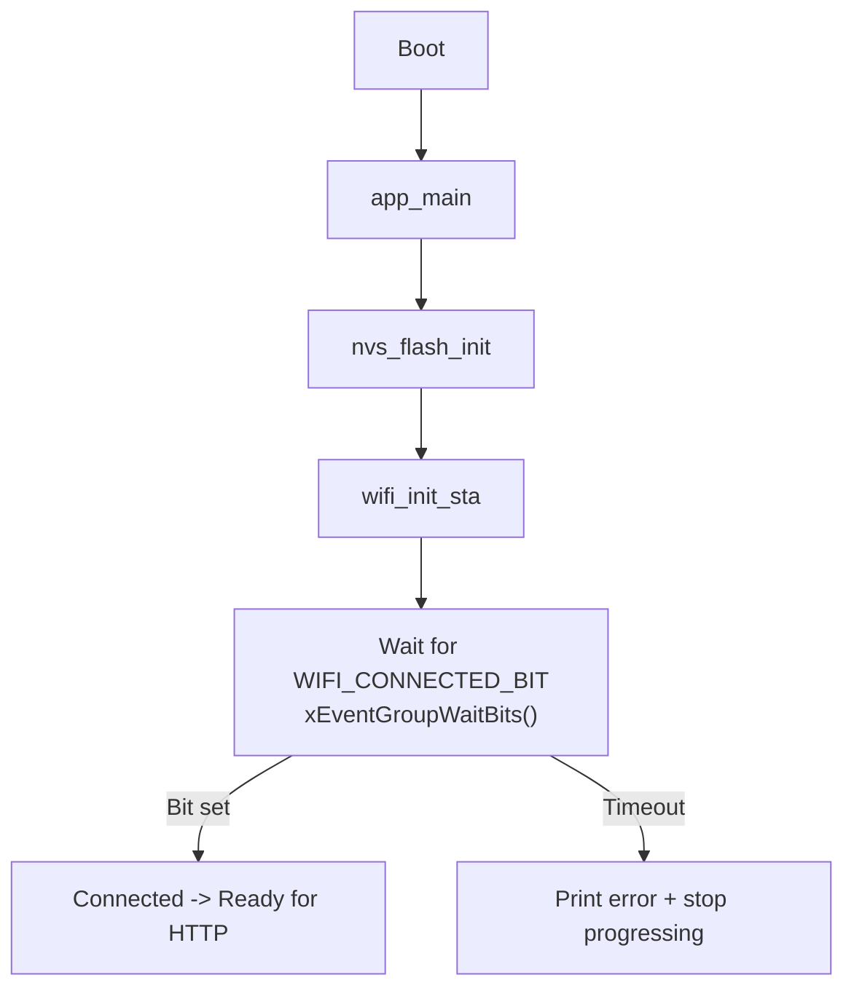
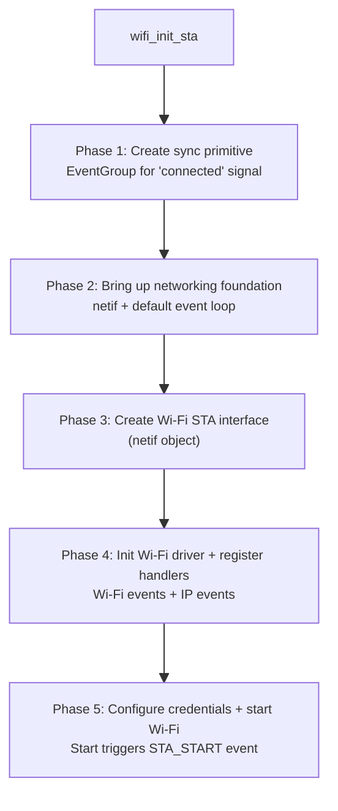
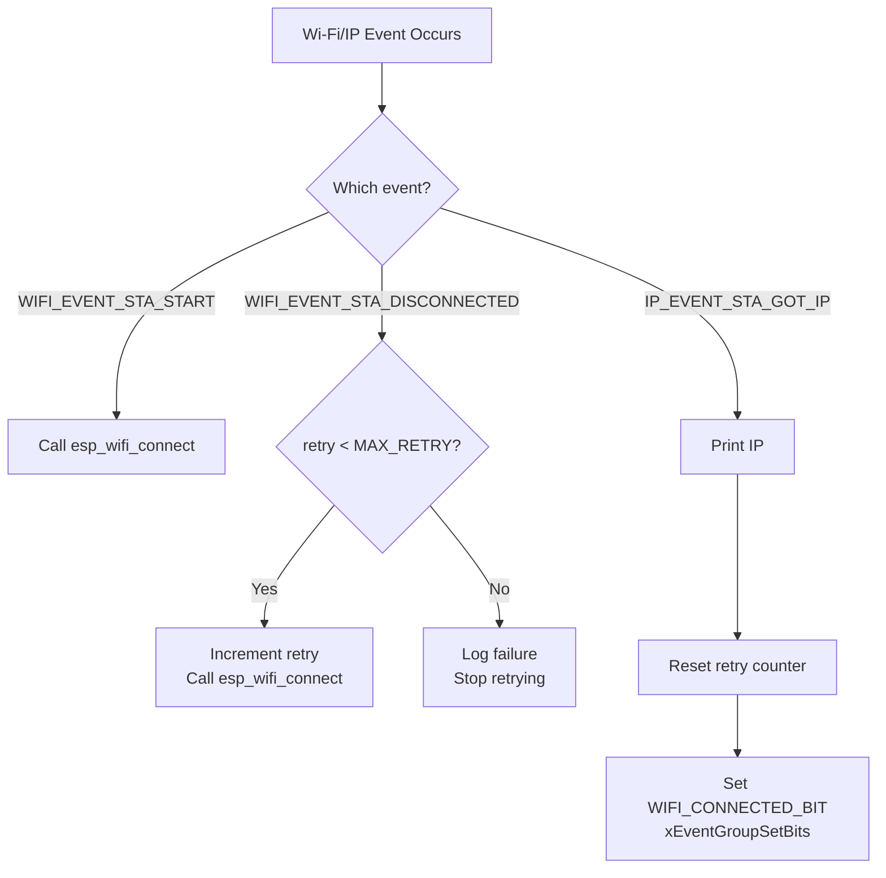
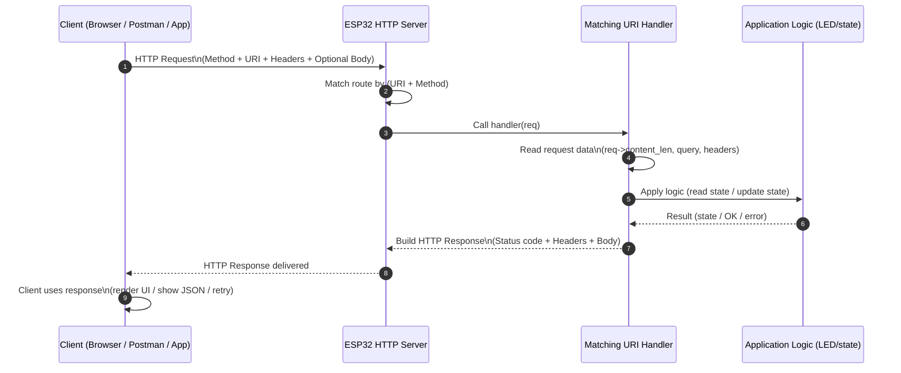

# Wi-FI Programming Lab: HTTP Server

## Required Resources

### Hardware
- ESP32‑C6 DevKit (1 per student/team)
- USB‑C cable (data-capable)
- Optional: LED + 330 Ω resistor + jumper wires (if board LED is unknown)

### Software
- ESP‑IDF (v5.x recommended)
- VS Code + ESP‑IDF extension or PlatformIO (ESP‑IDF)
- Browser (Chrome/Firefox)
- Optional: Wireshark (for network traffic analysis)

### Documentation
- ESP‑IDF Wi‑Fi Programming Guide (for reference during debugging)
- ESP‑IDF HTTP Server component docs

## Lab 1: Basic Wifi Setup

In this lab, we will create a firmware which permits us to print a sca list of the following:

- SSID
- RSSI
- Channel
- Auth mode(Open, WPA2, etc.)

### Concepts

- NVS (Non-Volatile Storage) `nvs_flash`

>> This is a flash-backed key/value storage used by ESP-IDF components. Wi-Fi drivers store calibration + PHY data and may store settings like Wi-Fi credentials here. Initializing NVS is a common first step in Wi-Fi applications.

- Network Interface Layer `esp_netif`

>> THis is the ESP-IDF abstraction of the network interface layer(STA/AP).

- Event Loop `esp_event`

>> ESP-IDF uses an event-driven programming model. The event loop allows you to register handlers for various system events, including Wi-Fi events (e.g., scan complete, connected, disconnected). 

??? Handler Reminder
    A handler is a function that is called in response to an event. For example, when a Wi-Fi scan completes, the registered handler for the scan complete event will be invoked to process the results.

### Function Glossary

??? example "nvs_flash_init()"
    
    === "Use" 
        Initializes **NVS (Non-Volatile Storage)** so other components (like **Wi-Fi**) can safely read/write calibration/config data in flash.

    === "Why" 
        The Wi-Fi stack depends on NVS; skipping it commonly causes runtime errors or Wi-Fi init failures.


    === "Syntax Use Case"
        ```c
        esp_err_t ret = nvs_flash_init();
        if (ret == ESP_ERR_NVS_NO_FREE_PAGES || ret == ESP_ERR_NVS_NEW_VERSION_FOUND) {
            // This can happen if flash partition was changed or NVS is corrupted.
            // Erase and re-init is a common recovery in labs.
            ESP_ERROR_CHECK(nvs_flash_erase());
            ESP_ERROR_CHECK(nvs_flash_init());
        } else {
            ESP_ERROR_CHECK(ret);
        }
        ```
        Where `ret` is the return value indicating success or failure of the initialization.  


??? example "esp_netif_init()"
    === "Use" 
        Initializes the **network interface layer** that bridges the Wi-Fi driver to the TCP/IP stack.

    === "Why" 
        Without it, networking features cannot properly create interfaces (STA/AP), and later you won’t get IP networking reliably.

    === "Syntax Use Case"
        ```c
        ESP_ERROR_CHECK(esp_netif_init());
        ```
        Call once early in `app_main()` before creating Wi-Fi network interfaces.

??? example "esp_event_loop_create_default()"

    === "Use" 
        Creates the default **system event loop** used to dispatch Wi-Fi/IP events.

    === "Why" 
        Wi-Fi internally posts events (scan done, connect, disconnect, got IP). Later labs will register handlers to react to these events.

    === "Syntax Use Case"
        ```c
        ESP_ERROR_CHECK(esp_event_loop_create_default());
        ```
        Create it before starting Wi-Fi or registering handlers.


??? example "esp_netif_create_default_wifi_sta()"

    === "Use" 
        Creates a default **Wi-Fi Station (STA)** network interface object.

    === "Why" 
        The Wi-Fi driver needs a STA interface to integrate with networking features (and later obtain an IP address when connecting).

    === "Syntax Use Case"
        ```c
        esp_netif_create_default_wifi_sta();
        ```
        Typically called once during Wi-Fi initialization (before `esp_wifi_start()`).


??? example "esp_wifi_init(&cfg)"

    === "Use" 
        Initializes the Wi-Fi driver and allocates required internal resources.

    === "Why" 
        You must initialize the driver before setting mode, starting Wi-Fi, scanning, or connecting.

    === "Syntax Use Case"
        ```c
        wifi_init_config_t cfg = WIFI_INIT_CONFIG_DEFAULT();
        ESP_ERROR_CHECK(esp_wifi_init(&cfg));
        ```
        Where `cfg` contains default driver configuration values.


??? example "esp_wifi_set_mode(WIFI_MODE_STA)"

    === "Use" 
        Sets the Wi-Fi mode to **Station** (client).

    === "Why" 
        Scanning and connecting as a client is done in STA mode (typical IoT device behavior).

    === "Syntax Use Case"
        ```c
        ESP_ERROR_CHECK(esp_wifi_set_mode(WIFI_MODE_STA));
        ```
        Call after `esp_wifi_init()` and before `esp_wifi_start()`.


??? example "esp_wifi_start()"

    === "Use" 
        Starts the Wi-Fi driver (enables radio operation).

    === "Why" 
        The driver must be started before performing operations like scanning or connecting.

    === "Syntax Use Case"
        ```c
        ESP_ERROR_CHECK(esp_wifi_start());
        ```
        Call after setting Wi-Fi mode/config.


??? example "esp_wifi_scan_start(&scan_config, true)"

    === "Use" 
        Starts a Wi-Fi scan for nearby Access Points (APs).

    === "Why" 
        Scanning helps you observe the RF environment (channels, signal strength, security types) and debug connectivity issues.

    === "Syntax Use Case"
        ```c
        wifi_scan_config_t scan_cfg = {
            .ssid = NULL,
            .bssid = NULL,
            .channel = 0,       // 0 = scan all channels
            .show_hidden = true // include hidden SSIDs
        };

        ESP_ERROR_CHECK(esp_wifi_scan_start(&scan_cfg, true));
        ```
        Where the second parameter `true` means **blocking** until scan completes.


??? example "esp_wifi_scan_get_ap_num(&ap_num)"

    === "Use" 
        Returns how many APs were found during the last scan.

    === "Why" 
        You need the count before reading AP records (and to limit memory usage).

    === "Syntax Use Case"
        ```c
        uint16_t ap_count = 0;
        ESP_ERROR_CHECK(esp_wifi_scan_get_ap_num(&ap_count));
        ESP_LOGI(TAG, "APs found: %u", ap_count);
        ```
        Where `ap_count` is filled with the number of discovered APs.


??? example "esp_wifi_scan_get_ap_records(&ap_num, ap_records)"

    === "Use" 
        Retrieves the AP records (SSID, RSSI, channel, auth mode, etc.) from the last scan.

    === "Why" 
        This is how you access real scan data and print a table for analysis.

    === "Syntax Use Case"
        ```c
        const uint16_t MAX_AP = 20;
        wifi_ap_record_t aps[MAX_AP];

        uint16_t number = MAX_AP; // in: max to read, out: actually read
        ESP_ERROR_CHECK(esp_wifi_scan_get_ap_records(&number, aps));

        for (int i = 0; i < number; i++) {
            ESP_LOGI(TAG, "SSID:%s RSSI:%d CH:%d AUTH:%d",
                    (char*)aps[i].ssid, aps[i].rssi, aps[i].primary, aps[i].authmode);
        }
        ```
        Where `number` is both an input limit and an output count of returned records.

### Example Code

ESP-IDF Wi-Fi has a clear lifecycle:

1.Initialize driver
2.Select mode (STA/AP)
3.Start Wi-Fi
4.Perform scan and read results

```c
/*
 * LAB 1 — Wi-Fi Scan
 *
 * Learning Goals:
 *  - The minimum initialization pipeline required for Wi-Fi in ESP-IDF
 *  - How to scan for Access Points (APs)
 *  - How to interpret RSSI, channel, and auth mode
 */

//Libraries for standard C functions 
#include <string.h>
#include <stdio.h>
//Libraries for FreeRTOS (task management)
#include "freertos/FreeRTOS.h"
#include "freertos/task.h"
//Libraries for ESP-IDF logging and error handling
#include "esp_log.h"
#include "esp_err.h"
//Libraries for Wi-Fi and related components
#include "nvs_flash.h"     // nvs_flash_init() lives here
#include "esp_netif.h"     // esp_netif_init(), esp_netif_create_default_wifi_sta() lives here
#include "esp_event.h"     // esp_event_loop_create_default() lives here
#include "esp_wifi.h"      // Wi-Fi driver + scan APIs live here

static const char *TAG = "LAB_1";//Tag for logging

/*
 * Function Use:
 * Convert auth mode enum to a readable string. Enum is a special type of data to define a series of named integer 
 * constants. This is useful for printing human-friendly output instead of numeric codes. 
 */
static const char *authmode_to_str(wifi_auth_mode_t a)
{
    /*Let's remember authentication is the security process of verifying the identity of a device (phone, laptop) attempting to connect to a wireless network before granting it access. */
    switch (a) {
        case WIFI_AUTH_OPEN:            return "OPEN";
        case WIFI_AUTH_WEP:             return "WEP";
        case WIFI_AUTH_WPA_PSK:         return "WPA";
        case WIFI_AUTH_WPA2_PSK:        return "WPA2";
        case WIFI_AUTH_WPA_WPA2_PSK:    return "WPA/WPA2";
        case WIFI_AUTH_WPA2_ENTERPRISE: return "WPA2-ENT";
        case WIFI_AUTH_WPA3_PSK:        return "WPA3";
        case WIFI_AUTH_WPA2_WPA3_PSK:   return "WPA2/WPA3";
        default:                        return "UNKNOWN";
    }
}

/*
 * Function Use:
 * Perform a Wi-Fi scan and print top N results.
 * Note: This Lab does not connect to any network yet.
 */
static void wifi_scan_and_print(void)
{
    // Scan configuration:
    // - channel=0 means "scan all channels"
    // - ssid/bssid NULL means "no filter, include all"
    // - show_hidden=true includes SSIDs that do not broadcast (rare, but useful)
    wifi_scan_config_t scan_cfg = {
        .ssid = NULL,
        .bssid = NULL,
        .channel = 0,
        .show_hidden = true,

        // You can later introduce active/passive scan options if desired:
        // .scan_type = WIFI_SCAN_TYPE_ACTIVE,
        // .scan_time.active.min = 100,
        // .scan_time.active.max = 300
    };

    ESP_LOGI(TAG, "Starting Wi-Fi scan (blocking until complete)...");
    ESP_ERROR_CHECK(esp_wifi_scan_start(&scan_cfg, true)); // true = block until done

    // Get how many APs were found
    uint16_t ap_count = 0;
    ESP_ERROR_CHECK(esp_wifi_scan_get_ap_num(&ap_count));
    ESP_LOGI(TAG, "Scan complete. APs found: %u", ap_count);

    // Limit how many records we read to avoid huge stack usage
    const uint16_t MAX_AP_PRINT = 20;
    wifi_ap_record_t ap_records[MAX_AP_PRINT];

    uint16_t number = (ap_count < MAX_AP_PRINT) ? ap_count : MAX_AP_PRINT;

    // Read up to 'number' records into ap_records[]
    ESP_ERROR_CHECK(esp_wifi_scan_get_ap_records(&number, ap_records));

    ESP_LOGI(TAG, "Printing top %u results:", number);
    ESP_LOGI(TAG, "Idx | RSSI | CH | AUTH     | SSID");
    ESP_LOGI(TAG, "----+------+----+----------+------------------------------");

    for (int i = 0; i < number; i++) {
        // RSSI: closer to 0 is stronger (e.g., -35 is strong, -85 is weak)
        // primary: channel number
        // ssid: AP name (null-terminated string)
        ESP_LOGI(TAG, "%3d | %4d | %2d | %-8s | %s",
                 i,
                 ap_records[i].rssi,
                 ap_records[i].primary,
                 authmode_to_str(ap_records[i].authmode),
                 (char *)ap_records[i].ssid);
    }

}

/*
 * Minimal Wi-Fi initialization required before scanning.
 * Order matters:
 *  1) NVS
 *  2) netif
 *  3) event loop
 *  4) create default STA interface
 *  5) Wi-Fi init + set mode + start
 */
static void wifi_init_for_scan(void)
{
    // 1) NVS initialization (required by Wi-Fi)
    esp_err_t ret = nvs_flash_init();
    if (ret == ESP_ERR_NVS_NO_FREE_PAGES || ret == ESP_ERR_NVS_NEW_VERSION_FOUND) {
        // This can happen if flash partition was changed or NVS is corrupted.
        // Erase and re-init is a common recovery in labs.
        ESP_ERROR_CHECK(nvs_flash_erase());
        ESP_ERROR_CHECK(nvs_flash_init());
    } else {
        ESP_ERROR_CHECK(ret);
    }

    // 2) Initialize network interface layer
    ESP_ERROR_CHECK(esp_netif_init());

    // 3) Create the default event loop
    ESP_ERROR_CHECK(esp_event_loop_create_default());

    // 4) Create default Wi-Fi STA interface
    esp_netif_create_default_wifi_sta();

    // 5) Initialize Wi-Fi driver
    wifi_init_config_t cfg = WIFI_INIT_CONFIG_DEFAULT();
    ESP_ERROR_CHECK(esp_wifi_init(&cfg));

    // Set station mode (we are a client, not an AP)
    ESP_ERROR_CHECK(esp_wifi_set_mode(WIFI_MODE_STA));

    // Start Wi-Fi driver (turns radio on and enables operations like scan)
    ESP_ERROR_CHECK(esp_wifi_start());

    ESP_LOGI(TAG, "Wi-Fi initialized and started in STA mode.");
}

void app_main(void)
{
    ESP_LOGI(TAG, "Lab 1 start: Wi-Fi scan demo.");

    wifi_init_for_scan();
    wifi_scan_and_print();

    ESP_LOGI(TAG, "Lab 1 done. You can reset to scan again.");
}
```

### Required Lab Log with evidence

- Screenshot of serial terminal showing the printed scan results table with at least 5 APs listed.
- Answer the following questions:
  1. What is the SSID of the strongest AP detected in your scan?
  2. What is the RSSI value of that AP?
  3. What authentication mode does that AP use?
  4. What channel is that AP operating on?
  5. Which channel had the most APs detected in your scan?

- Modify your code to sort the printed AP list by RSSI (strongest to weakest) before printing. Submit the modified code along with a screenshot of the new output.

---

## Lab 2 Wi‑Fi Station Connect (STA) + Reconnect 

In this lab, we will connect to an AP using SSID/PASS and handle connect/disconnect events robustly.

ESP‑IDF uses the **event loop**:
- `WIFI_EVENT_STA_START` → call `esp_wifi_connect()`
- `IP_EVENT_STA_GOT_IP` → you are “online”
- `WIFI_EVENT_STA_DISCONNECTED` → retry (with limit/backoff)

### Concepts

- wifi_config_t 

>> Is a struct that holds Wi-Fi configuration parameters, including SSID and password for station mode. You fill this struct before calling `esp_wifi_set_config()` to apply the settings.

- Connection Management Events

>> Instead of “blocking connect()”, ESP-IDF reports state changes via events: WIFI events: radio/association states and IP events: DHCP result (“got IP”)


### Function Glossary

??? example "esp_event_handler_register()"

    === "Use" 
        Registers a callback function to receive events from a given event base (e.g., Wi-Fi or IP).

    === "Why" 
        Wi-Fi connect/disconnect and “got IP” are reported asynchronously. You must register handlers to respond.

    === "Syntax Use Case"
        ```c
        ESP_ERROR_CHECK(esp_event_handler_register(
            WIFI_EVENT,              // event base
            ESP_EVENT_ANY_ID,        // catch all Wi-Fi event IDs
            &wifi_event_handler,     // callback
            NULL                     // user argument
        ));

        ESP_ERROR_CHECK(esp_event_handler_register(
            IP_EVENT,
            IP_EVENT_STA_GOT_IP,     // only care about got-IP
            &wifi_event_handler,
            NULL
        ));
        ```
        Where `wifi_event_handler` is your callback used to process Wi-Fi/IP events.

??? example "esp_wifi_set_config()"

    === "Use" 
        Applies a Wi-Fi configuration (`wifi_config_t`) to a specific interface (here: STA).

    === "Why" 
        Without setting SSID/password, the device cannot associate to the AP.

    === "Syntax Use Case"
        ```c
        wifi_config_t wifi_config = {0};
        strncpy((char*)wifi_config.sta.ssid, WIFI_SSID, sizeof(wifi_config.sta.ssid));
        strncpy((char*)wifi_config.sta.password, WIFI_PASS, sizeof(wifi_config.sta.password));

        ESP_ERROR_CHECK(esp_wifi_set_config(WIFI_IF_STA, &wifi_config));
        ```
        Where `wifi_config` contains STA credentials and `WIFI_IF_STA` selects the station interface.


??? example "esp_wifi_connect()"

    === "Use" 
        Starts the association/authentication process to the configured AP (SSID/PASS).

    === "Why" 
        In ESP-IDF STA mode, you typically call this in response to `WIFI_EVENT_STA_START` or after a disconnect.

    === "Syntax Use Case"
        ```c
        // Common pattern: connect when STA starts
        if (event_base == WIFI_EVENT && event_id == WIFI_EVENT_STA_START) {
            esp_wifi_connect();
        }
        ```
        Typically called inside an event handler based on the STA lifecycle.

??? example "EventGroupHandle_t + xEventGroupWaitBits()"

    === "Use" 
        A synchronization tool to wait for a condition (here: “connected to Wi-Fi and got IP”) using bit flags.

    === "Why" 
        Wi-Fi connection is asynchronous. This prevents your program from starting HTTP logic before networking is ready.

    === "Syntax Use Case"
        ```c
        static EventGroupHandle_t s_wifi_event_group;
        #define WIFI_CONNECTED_BIT BIT0

        // Wait up to 30 seconds for connection
        EventBits_t bits = xEventGroupWaitBits(
            s_wifi_event_group,
            WIFI_CONNECTED_BIT,
            pdFALSE,
            pdTRUE,
            pdMS_TO_TICKS(30000)
        );

        if (bits & WIFI_CONNECTED_BIT) {
            ESP_LOGI(TAG, "Connected!");
        }
        ```
        Where `WIFI_CONNECTED_BIT` is set by your event handler when `IP_EVENT_STA_GOT_IP` occurs.

### Flow Diagram

<div style="display:flex; gap:1rem; align-items:flex-start; flex-wrap:wrap;">

  <!-- Column 1 -->
  <div style="flex:1; min-width:30%;">
    <h3>1) Boot → app_main()</h3>


</div> 
<!-- Column 2 --> 
<div style="flex:1; min-width:30%;"> <h3>2) wifi_init_sta() — setup pipeline</h3>

</div> 
<!-- Column 3 --> 
<div style="flex:1; min-width:30%;"> <h3>3) Event handler — decision logic</h3>

</div> 
</div>
### Example Code

Firmware that:

1. Connects to a Wi-Fi AP using SSID/PASS (via menuconfig or defines)
1. Prints Got IP: x.x.x.x
1. Retries on disconnect (up to MAX_RETRY)
1. Times out gracefully if it cannot connect


```c 
/*
 * Lab 2 — Wi-Fi Station Connect (STA) + Reconnect
 *
 * Learning Goals:
 *  - How to connect to Wi-Fi as a station (client)
 *  - How to react to connection events using the event loop
 *  - How to implement a basic reconnect strategy
 *  - How to wait until "got IP" before continuing
 */
// Standard C library for string functions
#include <string.h>
#include <stdio.h>
// RTOS libraries for event groups and tasks
#include "freertos/FreeRTOS.h"
#include "freertos/event_groups.h" //Esp_event_group_create(), xEventGroupWaitBits() live here
// Libraries for ESP-IDF logging and error handling
#include "esp_log.h"
#include "esp_err.h"
// Libraries for NVS, network interfaces, event loop, and Wi-Fi
#include "nvs_flash.h"
#include "esp_netif.h" 
#include "esp_event.h"
#include "esp_wifi.h" // Wi-Fi driver and event APIs live here

// Logging tag for this lab
static const char *TAG = "LAB_2";

/*
 * Event Group used to signal connection status to the main flow.
 * We will set WIFI_CONNECTED_BIT when we obtain an IP address.
 */
static EventGroupHandle_t s_wifi_event_group;
#define WIFI_CONNECTED_BIT BIT0

/*
 * IMPORTANT:
 * For the lab, prefer putting SSID/PASS in menuconfig.
 * If you haven't created menuconfig entries yet, you can temporarily
 * hardcode them here (NOT recommended long-term).
 */
#ifndef WIFI_SSID
#define WIFI_SSID "YOUR_SSID"
#endif

#ifndef WIFI_PASS
#define WIFI_PASS "YOUR_PASS"
#endif

// Reconnect logic
static int s_retry = 0; // Counts how many times we've retried connection
#define MAX_RETRY 10

/*
 * wifi_event_handler()
 * -------------------
 * This single callback handles both WIFI_EVENT and IP_EVENT.
 *
 * Key mapping:
 *  - WIFI_EVENT_STA_START      -> call esp_wifi_connect()
 *  - WIFI_EVENT_STA_DISCONNECTED -> retry connection
 *  - IP_EVENT_STA_GOT_IP       -> "online", set event group bit
 */
static void wifi_event_handler(void *arg,
                               esp_event_base_t event_base,
                               int32_t event_id,
                               void *event_data)
{
    // 1) Wi-Fi driver says STA started -> attempt connect
    if (event_base == WIFI_EVENT && event_id == WIFI_EVENT_STA_START) {
        ESP_LOGI(TAG, "WIFI_EVENT_STA_START -> esp_wifi_connect()");
        ESP_ERROR_CHECK(esp_wifi_connect());
        return;
    }

    // 2) Disconnected -> retry (up to MAX_RETRY)
    if (event_base == WIFI_EVENT && event_id == WIFI_EVENT_STA_DISCONNECTED) {

        // Optional: you can inspect reason codes here later
        // wifi_event_sta_disconnected_t *disc = (wifi_event_sta_disconnected_t*)event_data;

        if (s_retry < MAX_RETRY) {
            s_retry++;
            ESP_LOGW(TAG, "Disconnected. Retrying (%d/%d)...", s_retry, MAX_RETRY);

            // Re-attempt association
            ESP_ERROR_CHECK(esp_wifi_connect());
        } else {
            ESP_LOGE(TAG, "Failed to connect after %d retries.", MAX_RETRY);
            // NOTE: we do not set WIFI_CONNECTED_BIT
        }
        return;
    }

    // 3) IP acquired (DHCP success) -> signal to main flow
    if (event_base == IP_EVENT && event_id == IP_EVENT_STA_GOT_IP) {
        ip_event_got_ip_t *event = (ip_event_got_ip_t *)event_data;

        ESP_LOGI(TAG, "Got IP: " IPSTR, IP2STR(&event->ip_info.ip));

        // Reset retry counter after a successful connection
        s_retry = 0;

        // Signal "connected" to whoever is waiting
        xEventGroupSetBits(s_wifi_event_group, WIFI_CONNECTED_BIT);
        return;
    }
}

/*
 * wifi_init_sta()
 * --------------
 * Sets up the full stack needed for STA connect:
 *  - netif + default event loop
 *  - default Wi-Fi STA interface
 *  - Wi-Fi driver init
 *  - event handler registration
 *  - apply SSID/PASS
 *  - start Wi-Fi (which triggers WIFI_EVENT_STA_START)
 */
static void wifi_init_sta(void)
{
    // Create the event group that we will use to signal connection
    s_wifi_event_group = xEventGroupCreate();

    // Initialize networking foundations (same as Lab 1)
    ESP_ERROR_CHECK(esp_netif_init());
    ESP_ERROR_CHECK(esp_event_loop_create_default());

    // Create a default STA network interface object
    esp_netif_create_default_wifi_sta();

    // Initialize Wi-Fi driver
    wifi_init_config_t cfg = WIFI_INIT_CONFIG_DEFAULT();
    ESP_ERROR_CHECK(esp_wifi_init(&cfg));

    // Register event handlers
    ESP_ERROR_CHECK(esp_event_handler_register(
        WIFI_EVENT, ESP_EVENT_ANY_ID, &wifi_event_handler, NULL));

    ESP_ERROR_CHECK(esp_event_handler_register(
        IP_EVENT, IP_EVENT_STA_GOT_IP, &wifi_event_handler, NULL));

    // Fill Wi-Fi configuration struct (STA credentials)
    wifi_config_t wifi_config = {0};

    // Copy SSID/PASS safely into fixed-size arrays
    strncpy((char *)wifi_config.sta.ssid, WIFI_SSID, sizeof(wifi_config.sta.ssid));
    strncpy((char *)wifi_config.sta.password, WIFI_PASS, sizeof(wifi_config.sta.password));

    // Optional: recommended defaults for many labs
    // wifi_config.sta.threshold.authmode = WIFI_AUTH_WPA2_PSK;

    ESP_LOGI(TAG, "Configuring Wi-Fi STA: SSID='%s'", WIFI_SSID);

    // Set mode + apply config + start
    ESP_ERROR_CHECK(esp_wifi_set_mode(WIFI_MODE_STA));
    ESP_ERROR_CHECK(esp_wifi_set_config(WIFI_IF_STA, &wifi_config));
    ESP_ERROR_CHECK(esp_wifi_start());

    // After esp_wifi_start(), the driver will emit WIFI_EVENT_STA_START,
    // which triggers esp_wifi_connect() inside our handler.
}

/*
 * app_main()
 * ----------
 * Initializes NVS and starts STA connect.
 * Then waits (up to 30s) until WIFI_CONNECTED_BIT is set by GOT_IP.
 */
void app_main(void)
{
    ESP_LOGI(TAG, "Lab 2 start: Wi-Fi STA connect + reconnect.");

    // NVS is required by Wi-Fi (same recovery pattern as Lab 1)
    esp_err_t ret = nvs_flash_init();
    if (ret == ESP_ERR_NVS_NO_FREE_PAGES || ret == ESP_ERR_NVS_NEW_VERSION_FOUND) {
        ESP_ERROR_CHECK(nvs_flash_erase());
        ESP_ERROR_CHECK(nvs_flash_init());
    } else {
        ESP_ERROR_CHECK(ret);
    }

    wifi_init_sta();

    // Wait until connected (GOT_IP) or timeout
    EventBits_t bits = xEventGroupWaitBits(
        s_wifi_event_group,
        WIFI_CONNECTED_BIT,
        pdFALSE,
        pdTRUE,
        pdMS_TO_TICKS(30000)
    );

    if (bits & WIFI_CONNECTED_BIT) {
        ESP_LOGI(TAG, "Connected! Ready for next steps (HTTP server).");
    } else {
        ESP_LOGE(TAG, "Timeout waiting for Wi-Fi connection.");
        ESP_LOGE(TAG, "Check SSID/PASS, 2.4GHz availability, or router security.");
    }
}
```

### Required Lab Log with evidence

1. Serial terminal showing a successful connection including:

    - WIFI_EVENT_STA_START
    - Got IP: x.x.x.x
    - Connected! Ready...

2. Serial terminal showing a failed connection attempt (intentional) including:

    - at least 3 retry lines
    - and the final outcome (either timeout or max retries)

Answer the following questions:

- What event indicates “Wi-Fi driver started and is ready to connect”? (event name)
- What event indicates “network stack has an IP and the device is online”? (event name)
- What is the assigned IP address?
- How many retries occurred before success or failure?
- In your logs, which happened first: WIFI_EVENT_STA_START or IP_EVENT_STA_GOT_IP? Why?

## Lab 3: HTTP Server

### Concepts

- Embedded HTTP Server (`esp_http_server`)

>> ESP-IDF includes a lightweight HTTP server that runs on the device and calls your handlers when requests arrive.

- URI Handlers(Handlers per endpoint)

>> You register `httpd_uri_t` routes like: 

>> - `/` → HTML page
>> - `/api/led` → JSON API (GET/POST)

- Request body reading (httpd_req_recv)

>> POST requests may carry a JSON body (e.g., `{"state":1}`). You must read it explicitly.

- Content-Type / MIME

>> Browsers interpret responses based on `Content-Type`:

>> - HTML: `text/html`
>> - JSON: `application/json`

- Concurrency note (server calls your code)

>> HTTP handlers are called by the server’s internal task(s). Keep handlers short, deterministic, and avoid blocking.

| Method      | Meaning                                                                            | Example (in this lab)                                                                                                                     |
| ----------- | ---------------------------------------------------------------------------------- | ----------------------------------------------------------------------------------------------------------------------------------------- |
| **GET**     | Read / request a resource. Should not change device state (ideally).               | I opened `http://<ESP_IP>/api/led` in the browser and the ESP replied with `{"state":0}` (LED was OFF).                                   |
| **POST**    | Send data to the server to create/trigger an action. Commonly changes state.       | I sent `POST /api/led` with body `{"state":1}` and the LED turned ON. The ESP replied `{"ok":true}`.                                      |
| **PUT**     | Replace/update a resource at a known URI (often idempotent).                       |  If we implemented `PUT /api/led` with `{"state":1}`, repeating it would keep the LED ON (no additional changes). |
| **DELETE**  | Remove a resource (or request a delete-like action).                               |  If we implemented `DELETE /api/led`, it could reset the LED state to OFF and clear any stored setting.           |
| **PATCH**   | Partially update a resource (modify only specific fields).                         |  If we had multiple settings, `PATCH /api/config` could update only `"blink_ms"` without replacing everything.    |
| **HEAD**    | Same as GET, but returns headers only (no body). Used to check if resource exists. |  A client could send `HEAD /api/led` to verify the endpoint exists without downloading the JSON body.             |
| **OPTIONS** | Ask the server which methods are allowed (CORS/preflight in browsers).             | *(Not used explicitly)* Browsers may send `OPTIONS /api/led` automatically if you add CORS headers later.                                 |


### Function Glossary


??? example "httpd_start()"
    === "Use" 
        Starts the ESP-IDF HTTP server instance.

    === "Why" 
        Without starting the server, no URI handlers will run and the ESP won’t listen on port 80.

    === "Syntax Use Case"
        ```c
        httpd_handle_t server = NULL;
        httpd_config_t config = HTTPD_DEFAULT_CONFIG();
        ESP_ERROR_CHECK(httpd_start(&server, &config));
        ```
        Where `server` is a handle used later to register URI handlers.

??? example "httpd_register_uri_handler()"
    === "Use" 
        Registers a route (URI + method) and maps it to a callback handler function.

    === "Why" 
        This is how you define endpoints like `/` or `/api/led`.

    === "Syntax Use Case"
        ```c
        httpd_uri_t led_get = {
            .uri = "/api/led",
            .method = HTTP_GET,
            .handler = api_led_get,
            .user_ctx = NULL
        };
        ESP_ERROR_CHECK(httpd_register_uri_handler(server, &led_get));
        ```
        Where `api_led_get` is your function called when a client requests `GET /api/led`.

??? example "httpd_resp_set_type()"
    === "Use" 
        Sets the response `Content-Type` header.

    === "Why" 
        Browsers and clients interpret the response based on MIME type (HTML vs JSON).

    === "Syntax Use Case"
        ```c
        httpd_resp_set_type(req, "application/json");
        httpd_resp_send(req, "{\"state\":1}", HTTPD_RESP_USE_STRLEN);
        ```
        Ensures the client treats the payload as JSON.

??? example "httpd_resp_send() / httpd_resp_sendstr()"
    === "Use" 
        Sends the response body (payload) to the client.

    === "Why" 
        Every handler must respond, even with an error.

    === "Syntax Use Case"
        ```c
        httpd_resp_sendstr(req, "<h1>Hello</h1>");
        ```
        Or for known buffer length:
        ```c
        httpd_resp_send(req, buf, HTTPD_RESP_USE_STRLEN);
        ```

??? example "httpd_req_recv()"
    === "Use" 
        Reads bytes from the HTTP request body (commonly used for POST/PUT).

    === "Why" 
        ESP-IDF does not automatically parse request bodies; you must read them.

    === "Syntax Use Case"
        ```c
        char buf[128] = {0};
        int r = httpd_req_recv(req, buf, MIN(req->content_len, (int)sizeof(buf)-1));
        if (r <= 0) {
            httpd_resp_send_err(req, HTTPD_400_BAD_REQUEST, "Empty body");
            return ESP_FAIL;
        }
        ```
        Where `req->content_len` is the Content-Length advertised by the client.

??? example "httpd_resp_send_err()"
    === "Use" 
        Sends an HTTP error response with a status code and message.

    === "Why" 
        Makes API failures explicit (bad JSON, missing fields, etc.).

    === "Syntax Use Case"
        ```c
        httpd_resp_send_err(req, HTTPD_400_BAD_REQUEST, "state must be 0 or 1");
        return ESP_FAIL;
        ```


### Flow Diagram



### Example Code

A running system where:

- Phone/PC opens `http://<ESP_IP>/` and sees a webpage
- Webpage can turn LED ON/OFF
- API works:
    - `GET /api/led` → `{"state":0|1}`
    - `POST /api/led` with `{"state":0|1}` → `{"ok":true}`

```c
/*
 * LAB D — ESP32-C6 Wi-Fi + HTTP LED Control (FULL WORKING FILE)
 *
 * Features:
 *  - Wi-Fi STA connect + reconnect using events
 *  - Wait for IP (WIFI_CONNECTED_BIT)
 *  - Simple GPIO LED control (gpio_reset_pin + gpio_set_direction)
 *  - HTTP server:
 *      GET  /         -> HTML UI
 *      GET  /api/led  -> JSON {"state":0|1}
 *      POST /api/led  -> JSON {"state":0|1} sets LED, returns {"ok":true}
 *
 * Tested target: ESP-IDF v5.x style
 */
// String handling and standard libraries
#include <string.h>
#include <stdio.h>
#include <stdlib.h>
// FreeRTOS and event groups
#include "freertos/FreeRTOS.h"
#include "freertos/event_groups.h"
// ESP-IDF Logging and error handling
#include "esp_log.h"
#include "esp_err.h"
// Wi-Fi and network
#include "nvs_flash.h"
#include "esp_netif.h"
#include "esp_event.h"
#include "esp_wifi.h"
// GPIO control
#include "driver/gpio.h"
// HTTP server
#include "esp_http_server.h"

/* ===================== User config ===================== */
#define WIFI_SSID "SSID_HERE"
#define WIFI_PASS "PASS_HERE"

/* LED pin (change to match your board) */
#define LED_GPIO  8

/* Reconnect policy */
#define MAX_RETRY 10

/* ===================== Globals ===================== */
static const char *TAG = "LAB_3";

// Wi-Fi event group and bit seen in Lab 2
static EventGroupHandle_t s_wifi_event_group;
#define WIFI_CONNECTED_BIT BIT0


static int s_retry = 0;// Retry count for Wi-Fi reconnects

static int s_led_state = 0;               // 0=OFF, 1=ON
static httpd_handle_t s_server = NULL;    // HTTP server handle

/* ===================== LED helpers (simple GPIO style) ===================== */
static void led_init(void)
{
    gpio_reset_pin(LED_GPIO);
    gpio_set_direction(LED_GPIO, GPIO_MODE_OUTPUT);

    s_led_state = 0;
    gpio_set_level(LED_GPIO, s_led_state);

    ESP_LOGI(TAG, "LED initialized on GPIO %d (state=%d)", LED_GPIO, s_led_state);
}

/*Function to set the LED from the state*/
static void led_set(int on)
{
    s_led_state = (on != 0);
    gpio_set_level(LED_GPIO, s_led_state);
    ESP_LOGI(TAG, "LED set to %d", s_led_state);
}

/* ===================== HTTP handlers ===================== */
/*Remember, handlers are special functions that process HTTP requests and generate responses*/


static esp_err_t api_led_get(httpd_req_t *req)
{
    /* resp is a buffer to hold the JSON response  text in this case our jason is
       either {"state":0} or {"state":1} */
    char resp[32];
    /*sprintf is a normal printf for strings, snprintf is safer because it 
    limits the number of characters written to the buffer
    
    Here we build the JSON string with the current LED state. 
    */
    snprintf(resp, sizeof(resp), "{\"state\":%d}", s_led_state);

    /* Tell the client (browser/Postman/etc.) that the payload is JSON.
       This sets the HTTP header: Content-Type: application/json */
    httpd_resp_set_type(req, "application/json");

    /* Send the response body to the client.
       - 'resp' is the payload
       - HTTPD_RESP_USE_STRLEN tells ESP-IDF to compute the string length automatically
         (it treats resp as a null-terminated C string). */
    httpd_resp_send(req, resp, HTTPD_RESP_USE_STRLEN);

    /* Return ESP_OK so the HTTP server knows the request was handled correctly. */
    return ESP_OK;
}

static esp_err_t api_led_post(httpd_req_t *req)
{
    // Basic safety: reject empty or very large payloads
    if (req->content_len <= 0 || req->content_len > 256) {
        httpd_resp_send_err(req, HTTPD_400_BAD_REQUEST, "Invalid Content-Length");
        return ESP_FAIL;
    }

    char buf[257] = {0}; // +1 for null terminator
    int received = httpd_req_recv(req, buf, req->content_len);
    if (received <= 0) {
        httpd_resp_send_err(req, HTTPD_400_BAD_REQUEST, "Empty body");
        return ESP_FAIL;
    }
    buf[received] = '\0';

    // Minimal parse: find "state":<number>
    int state = -1;
    char *p = strstr(buf, "\"state\"");
    if (p) {
        p = strchr(p, ':');
        if (p) state = atoi(p + 1);
    }

    if (state != 0 && state != 1) {
        httpd_resp_send_err(req, HTTPD_400_BAD_REQUEST, "state must be 0 or 1");
        return ESP_FAIL;
    }

    led_set(state);

    httpd_resp_set_type(req, "application/json");
    httpd_resp_sendstr(req, "{\"ok\":true}");
    return ESP_OK;
}

static esp_err_t root_get_handler(httpd_req_t *req)
{
    // Readable inline HTML (still C strings, but multi-line)
    static const char *INDEX_HTML =
        "<!doctype html>\n"
        "<html>\n"
        "<head>\n"
        "  <meta charset='utf-8'>\n"
        "  <meta name='viewport' content='width=device-width, initial-scale=1'>\n"
        "  <title>ESP32-C6 LED</title>\n"
        "</head>\n"
        "<body>\n"
        "  <h2>ESP32-C6 LED Control</h2>\n"
        "  <button onclick='setLed(1)'>ON</button>\n"
        "  <button onclick='setLed(0)'>OFF</button>\n"
        "  <p id='st'>State: ?</p>\n"
        "\n"
        "  <script>\n"
        "    async function refresh(){\n"
        "      const r = await fetch('/api/led');\n"
        "      const j = await r.json();\n"
        "      document.getElementById('st').innerText = 'State: ' + j.state;\n"
        "    }\n"
        "    async function setLed(v){\n"
        "      await fetch('/api/led', {\n"
        "        method: 'POST',\n"
        "        headers: {'Content-Type':'application/json'},\n"
        "        body: JSON.stringify({state:v})\n"
        "      });\n"
        "      refresh();\n"
        "    }\n"
        "    setInterval(refresh, 1000);\n"
        "    refresh();\n"
        "  </script>\n"
        "</body>\n"
        "</html>\n";

    httpd_resp_set_type(req, "text/html");
    httpd_resp_send(req, INDEX_HTML, HTTPD_RESP_USE_STRLEN);
    return ESP_OK;
}

static void http_server_start(void)
{
    httpd_config_t config = HTTPD_DEFAULT_CONFIG();
    ESP_ERROR_CHECK(httpd_start(&s_server, &config));
    ESP_LOGI(TAG, "HTTP server started");

    httpd_uri_t root = {
        .uri      = "/",
        .method   = HTTP_GET,
        .handler  = root_get_handler,
        .user_ctx = NULL
    };

    httpd_uri_t led_get = {
        .uri      = "/api/led",
        .method   = HTTP_GET,
        .handler  = api_led_get,
        .user_ctx = NULL
    };

    httpd_uri_t led_post = {
        .uri      = "/api/led",
        .method   = HTTP_POST,
        .handler  = api_led_post,
        .user_ctx = NULL
    };

    ESP_ERROR_CHECK(httpd_register_uri_handler(s_server, &root));
    ESP_ERROR_CHECK(httpd_register_uri_handler(s_server, &led_get));
    ESP_ERROR_CHECK(httpd_register_uri_handler(s_server, &led_post));

    ESP_LOGI(TAG, "Routes registered: /  ,  GET/POST /api/led");
}

/* ===================== Wi-Fi STA connect + events ===================== */

static void wifi_event_handler(void *arg,
                               esp_event_base_t event_base,
                               int32_t event_id,
                               void *event_data)
{
    if (event_base == WIFI_EVENT && event_id == WIFI_EVENT_STA_START) {
        ESP_LOGI(TAG, "WIFI_EVENT_STA_START -> esp_wifi_connect()");
        ESP_ERROR_CHECK(esp_wifi_connect());
        return;
    }

    if (event_base == WIFI_EVENT && event_id == WIFI_EVENT_STA_DISCONNECTED) {
        if (s_retry < MAX_RETRY) {
            s_retry++;
            ESP_LOGW(TAG, "Disconnected. Retrying (%d/%d)...", s_retry, MAX_RETRY);
            ESP_ERROR_CHECK(esp_wifi_connect());
        } else {
            ESP_LOGE(TAG, "Failed to connect after %d retries.", MAX_RETRY);
        }
        return;
    }

    if (event_base == IP_EVENT && event_id == IP_EVENT_STA_GOT_IP) {
        ip_event_got_ip_t *event = (ip_event_got_ip_t *)event_data;
        ESP_LOGI(TAG, "Got IP: " IPSTR, IP2STR(&event->ip_info.ip));

        s_retry = 0;
        xEventGroupSetBits(s_wifi_event_group, WIFI_CONNECTED_BIT);
        return;
    }
}

static void wifi_init_sta(void)
{
    s_wifi_event_group = xEventGroupCreate();

    ESP_ERROR_CHECK(esp_netif_init());
    ESP_ERROR_CHECK(esp_event_loop_create_default());
    esp_netif_create_default_wifi_sta();

    wifi_init_config_t cfg = WIFI_INIT_CONFIG_DEFAULT();
    ESP_ERROR_CHECK(esp_wifi_init(&cfg));

    ESP_ERROR_CHECK(esp_event_handler_register(WIFI_EVENT, ESP_EVENT_ANY_ID, &wifi_event_handler, NULL));
    ESP_ERROR_CHECK(esp_event_handler_register(IP_EVENT, IP_EVENT_STA_GOT_IP, &wifi_event_handler, NULL));

    wifi_config_t wifi_config = {0};
    strncpy((char *)wifi_config.sta.ssid, WIFI_SSID, sizeof(wifi_config.sta.ssid));
    strncpy((char *)wifi_config.sta.password, WIFI_PASS, sizeof(wifi_config.sta.password));

    ESP_LOGI(TAG, "Configuring Wi-Fi STA: SSID='%s'", WIFI_SSID);

    ESP_ERROR_CHECK(esp_wifi_set_mode(WIFI_MODE_STA));
    ESP_ERROR_CHECK(esp_wifi_set_config(WIFI_IF_STA, &wifi_config));
    ESP_ERROR_CHECK(esp_wifi_start());
}

/* ===================== app_main ===================== */

void app_main(void)
{
    ESP_LOGI(TAG, "Lab D start: Wi-Fi + HTTP + LED control.");

    // NVS init (required by Wi-Fi)
    esp_err_t ret = nvs_flash_init();
    if (ret == ESP_ERR_NVS_NO_FREE_PAGES || ret == ESP_ERR_NVS_NEW_VERSION_FOUND) {
        ESP_ERROR_CHECK(nvs_flash_erase());
        ESP_ERROR_CHECK(nvs_flash_init());
    } else {
        ESP_ERROR_CHECK(ret);
    }

    // Connect to Wi-Fi (STA)
    wifi_init_sta();

    // Wait for "got IP" (connected)
    EventBits_t bits = xEventGroupWaitBits(
        s_wifi_event_group,
        WIFI_CONNECTED_BIT,
        pdFALSE,
        pdTRUE,
        pdMS_TO_TICKS(30000)
    );

    if (!(bits & WIFI_CONNECTED_BIT)) {
        ESP_LOGE(TAG, "Timeout waiting for Wi-Fi connection. Check SSID/PASS and 2.4 GHz.");
        return;
    }

    // Start peripherals + HTTP
    led_init();
    http_server_start();

    ESP_LOGI(TAG, "Open: http://<ESP_IP>/ from a device on the same network.");
}
```