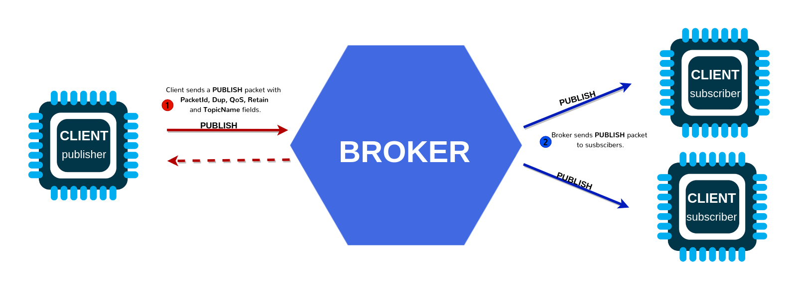

# Wi‑Fi Programming Lab: MQTT Client

---
## What is MQTT?

MQTT stands for **M**essage **Q**ueuing **T**elemetry **T**ransport. MQTT is a simple messaging protocol, designed for constrained devices with low bandwidth. So, it’s the perfect solution to exchange data between multiple IoT devices.

MQTT communication works as a publish and subscribe system. Devices publish messages on a specific topic. All devices that are subscribed to that topic receive the message.

<div style="text-align:center; width:80%;">
  
</div>

There are a few concepts that are important to understand when working with MQTT:

- **Publish/Subscribe**: Devices can publish messages to a topic or subscribe to a topic to receive messages.
- **Messages**: The actual data being sent, which can be in various formats (e.g., JSON, binary).
- **Topics**: The hierarchical structure used to route messages (e.g., `ibero/ei2/team3/c6_01/telemetry`).
- **Broker**: The central server that routes messages between clients.


### MQTT - Publish/Subscribe

The first concept is the publish and subscribe system. In a publish and subscribe system, a device can publish a message on a topic, or it can be subscribed to a particular topic to receive messages



- For example Device 1 publishes on a topic.
- Device 2 is subscribed to the same topic that device 1 is publishing in.
- So, device 2 receives the message.


### MQTT - Messages

Messages are the information that you want to exchange between your devices. It can be a message like a command or data like sensor readings, for example.


### MQTT - Topics

Another important concept is the topics. Topics are the way you register interest for incoming messages or how you specify where you want to publish the message.

Topics are represented with strings separated by a forward slash. Each forward slash indicates a topic level. Here’s an example of how you would create a topic for a lamp in your home office:

```
university/ibero/puebla/lab1/sensor42/telemetry/temperature
```

??? Note "How many levels does this topic have?" 
    7 levels. university · ibero · puebla · lab1 · sensor42 · telemetry · temperature

When creating your topic structure, use a consistent hierarchy so subscriptions stay simple.

Here's the why:

- Reads left→right from general → specific
- Lets you subscribe broadly (ibero/puebla/#) or narrowly (.../temperature)
- Keeps telemetry vs commands separate.

For example, if you wanted to control a lamp, the workflow would be:

1) A device publishes "on" and "off" messages on the **home/office/lamp** topic.
2) You have a device that controls a lamp, for example an ESP32. The ESP32 is subscribed to the **home/office/lamp** topic.
3) When a new message is published on that topic, the ESP32 receives the “on” or “off” messages and turns the lamp on or off.


### MQTT - Broker

The **MQTT broker** is responsible for receiving all messages, filtering the messages, deciding who is interested in them, and then publishing the message to all subscribed clients.

There are several brokers you can use. For example, you can use a local broker like Mosquitto.

---

## Quick Summary of MQTT concepts

### Concepts (theory → practice)

- **Broker**: the central server that routes messages between clients.
- **Client**: publisher and/or subscriber (ESP32‑C6 and your PC tools are clients).
- **Topic**: hierarchical routing string, e.g. `ibero/ei2/team3/temp`.
- **Payload**: bytes (often UTF‑8 text or JSON).
- **QoS**: delivery guarantees (0, 1, 2). Higher QoS = more overhead.
- **Retained**: broker stores last message for a topic and serves it to new subscribers.
- **LWT (Last Will and Testament)**: broker publishes a “device died” message when a client disconnects unexpectedly.
- **Keepalive**: heartbeat to detect dead connections.
- **Security**: username/password and/or TLS certificates.

---

## Lab 0: Broker + tools sanity check

### Objective
Prove your PC toolchain works *before* flashing the ESP32‑C6.

1) Start a broker

   - **Option A: Local Mosquitto**
     - Install [Mosquitto](https://mosquitto.org/download/) and start the service.
     - Confirm it listens on TCP `1883` by:
         - Windows: `netstat -an | find "1883"`
         - Test a topic with `mosquitto_pub` and `mosquitto_sub` 
         In one terminal, subscribe to a topic:

         ```bash
         mosquitto_sub -t "test/topic" -v
         ```
         and in another terminal, publish a message:

         ```bash
         mosquitto_pub -t "test/topic" -m "hello world"
         ```

   - **Option B: Public broker**

       - Use `test.mosquitto.org` (no auth, no TLS).
       - Broker URI: `mqtt://test.mosquitto.org:1883`

2) Open **MQTT Explorer**
   - Connect to the broker (host/IP, port 1883).
3) Create a test topic and message:
   - Publish to: `ibero/ei2/test/hello`
   - Payload: `{"msg":"hello from PC"}`
4) Subscribe in MQTT Explorer and confirm you can see it.

### Evidence required (lab log)
- Screenshot showing MQTT Explorer connected + the topic and payload visible.
- Broker address, port, and whether authentication is enabled.

---


## Lab 1: MQTT connect + subscribe + publish

### Objective
Connect the ESP32‑C6 to Wi‑Fi (STA) and then to the broker via MQTT, subscribe to a command topic, and publish telemetry/status.

### Concepts
- MQTT client lifecycle (init → connect → subscribe → publish → disconnect)
- Event-driven design: MQTT generates **events** (connected, data received, error, etc.)

### Function glossary (ESP‑IDF)
- `esp_mqtt_client_init()` – create client using configuration
- `esp_mqtt_client_start()` – begin connection and internal task
- `esp_mqtt_client_subscribe()` – subscribe to topics
- `esp_mqtt_client_publish()` – publish payloads
- `esp_mqtt_client_register_event()` – register event handler
- `esp_mqtt_event_handle_t` – event object (topic, data, lengths, event_id)

### Flow diagram (mental model)
1) **Wi‑Fi STA connects** → IP acquired  
2) **MQTT client starts** → connects to broker  
3) On `MQTT_EVENT_CONNECTED`: subscribe + publish “online” status  
4) On `MQTT_EVENT_DATA`: parse command topic/payload → act → publish ack/status  
5) Periodically publish telemetry (timer/task)

### Starter project structure
Use your prior Wi‑Fi STA project and add MQTT components.

```
main/
  app_main.c
  wifi_sta.c / wifi_sta.h         (or keep inside app_main if you prefer)
  mqtt_client_app.c / .h          (recommended split)
```

### Previous code segments (Wi‑Fi STA + Event Loop)

<details>
<summary><strong>Click to expand: Wi‑Fi STA connect skeleton (esp_netif + events)</strong></summary>

```c
#include <string.h>
#include "freertos/FreeRTOS.h"
#include "freertos/event_groups.h"
#include "esp_log.h"
#include "esp_err.h"
#include "esp_netif.h"
#include "esp_event.h"
#include "esp_wifi.h"

static const char *TAG = "WIFI_STA";

static EventGroupHandle_t s_wifi_event_group;

#define WIFI_CONNECTED_BIT BIT0
#define WIFI_FAIL_BIT      BIT1

static int s_retry = 0;
#define MAX_RETRY 10

static void wifi_event_handler(void *arg,
                               esp_event_base_t event_base,
                               int32_t event_id,
                               void *event_data)
{
    if (event_base == WIFI_EVENT && event_id == WIFI_EVENT_STA_START) {
        ESP_LOGI(TAG, "WIFI_EVENT_STA_START -> esp_wifi_connect()");
        esp_wifi_connect(); // don't ESP_ERROR_CHECK inside event handler
        return;
    }

    if (event_base == WIFI_EVENT && event_id == WIFI_EVENT_STA_DISCONNECTED) {

        if (s_retry < MAX_RETRY) {
            s_retry++;
            ESP_LOGW(TAG, "Disconnected. Retrying (%d/%d)...", s_retry, MAX_RETRY);
            esp_wifi_connect();
        } else {
            ESP_LOGE(TAG, "Failed to connect after %d retries.", MAX_RETRY);
            xEventGroupSetBits(s_wifi_event_group, WIFI_FAIL_BIT);
        }
        return;
    }

    if (event_base == IP_EVENT && event_id == IP_EVENT_STA_GOT_IP) {
        ip_event_got_ip_t *event = (ip_event_got_ip_t *)event_data;

        ESP_LOGI(TAG, "Got IP: " IPSTR, IP2STR(&event->ip_info.ip));
        s_retry = 0;

        xEventGroupSetBits(s_wifi_event_group, WIFI_CONNECTED_BIT);
        return;
    }
}

esp_err_t wifi_sta_connect(const char *ssid, const char *pass, uint32_t timeout_ms)
{
    s_wifi_event_group = xEventGroupCreate();
    if (!s_wifi_event_group) return ESP_ERR_NO_MEM;

    ESP_ERROR_CHECK(esp_netif_init());
    ESP_ERROR_CHECK(esp_event_loop_create_default());
    esp_netif_create_default_wifi_sta();

    wifi_init_config_t cfg = WIFI_INIT_CONFIG_DEFAULT();
    ESP_ERROR_CHECK(esp_wifi_init(&cfg));

    ESP_ERROR_CHECK(esp_event_handler_register(WIFI_EVENT, ESP_EVENT_ANY_ID, &wifi_event_handler, NULL));
    ESP_ERROR_CHECK(esp_event_handler_register(IP_EVENT, IP_EVENT_STA_GOT_IP, &wifi_event_handler, NULL));

    wifi_config_t wifi_config = {0};
    strncpy((char *)wifi_config.sta.ssid, ssid, sizeof(wifi_config.sta.ssid));
    strncpy((char *)wifi_config.sta.password, pass, sizeof(wifi_config.sta.password));

    ESP_LOGI(TAG, "Configuring Wi-Fi STA: SSID='%s'", ssid);

    ESP_ERROR_CHECK(esp_wifi_set_mode(WIFI_MODE_STA));
    ESP_ERROR_CHECK(esp_wifi_set_config(WIFI_IF_STA, &wifi_config));
    ESP_ERROR_CHECK(esp_wifi_start());

    EventBits_t bits = xEventGroupWaitBits(
        s_wifi_event_group,
        WIFI_CONNECTED_BIT | WIFI_FAIL_BIT,
        pdFALSE,
        pdFALSE,
        pdMS_TO_TICKS(timeout_ms)
    );

    if (bits & WIFI_CONNECTED_BIT) {
        ESP_LOGI(TAG, "Connected (GOT_IP).");
        return ESP_OK;
    }

    if (bits & WIFI_FAIL_BIT) {
        ESP_LOGE(TAG, "Failed to connect (max retries reached).");
        return ESP_FAIL;
    }

    ESP_LOGE(TAG, "Timeout waiting for Wi-Fi connection.");
    return ESP_ERR_TIMEOUT;
}
```

</details>

<details>
<summary><strong>Click to expand: Where to call Wi‑Fi init in <code>app_main()</code></strong></summary>

```c
// main.c (ESP32-C6 / ESP-IDF)
// Main entry point: NVS init → Wi-Fi STA connect → MQTT start

#include <stdio.h>
#include "freertos/FreeRTOS.h"
#include "freertos/task.h"
#include "esp_err.h"
#include "esp_log.h"
#include "nvs_flash.h"

#include "wifi_sta.h"
#include "mqtt_client_app.h"

static const char *TAG = "APP_MAIN";

// Fallback credentials (only used if menuconfig is not set)
#ifndef WIFI_SSID
#define WIFI_SSID "AndroidAP"
#endif

#ifndef WIFI_PASS
#define WIFI_PASS "kkcl99114"
#endif

// Broker URI (change as needed)
// Public broker example: "mqtt://test.mosquitto.org:1883"
#ifndef CONFIG_MQTT_BROKER_URI
#define CONFIG_MQTT_BROKER_URI "mqtt://test.mosquitto.org:1883"
#endif

void app_main(void)
{
    ESP_LOGI(TAG, "Booting...");

    // 1) NVS is required for Wi-Fi
    esp_err_t ret = nvs_flash_init();
    if (ret == ESP_ERR_NVS_NO_FREE_PAGES || ret == ESP_ERR_NVS_NEW_VERSION_FOUND) {
        ESP_ERROR_CHECK(nvs_flash_erase());
        ESP_ERROR_CHECK(nvs_flash_init());
    } else {
        ESP_ERROR_CHECK(ret);
    }

    // Prefer menuconfig credentials if they exist; fallback otherwise.
    const char *ssid =
    #ifdef CONFIG_WIFI_SSID
        CONFIG_WIFI_SSID;
    #else
        WIFI_SSID;
    #endif

    const char *pass =
    #ifdef CONFIG_WIFI_PASSWORD
        CONFIG_WIFI_PASSWORD;
    #else
        WIFI_PASS;
    #endif

    // 2) Connect to Wi-Fi
    ESP_LOGI(TAG, "Connecting to Wi-Fi SSID: %s", ssid);

    esp_err_t wifi_err = wifi_sta_connect(ssid, pass, 30000); // 30s timeout
    if (wifi_err != ESP_OK) {
        ESP_LOGE(TAG, "Wi-Fi connect failed: %s (0x%x)", esp_err_to_name(wifi_err), wifi_err);

        // For debugging: don't reboot-loop. Stop here.
        // Once your wifi_sta_connect() is fixed, you can switch back to ESP_ERROR_CHECK().
        while (1) {
            vTaskDelay(pdMS_TO_TICKS(1000));
        }
    }

    ESP_LOGI(TAG, "Wi-Fi connected!");

    // 3) Start MQTT
    ESP_LOGI(TAG, "Starting MQTT client: %s", CONFIG_MQTT_BROKER_URI);
    ESP_ERROR_CHECK(mqtt_app_start(CONFIG_MQTT_BROKER_URI));

    // Heartbeat
    while (1) {
        ESP_LOGI(TAG, "System running...");
        vTaskDelay(pdMS_TO_TICKS(5000));
    }
}
```

</details>

<details>
<summary><strong>Click to expand: Menuconfig keys (recommended)</strong></summary>

```text
Component config  → Wi‑Fi  → WiFi SSID
Component config  → Wi‑Fi  → WiFi Password
```
</details>

> **Instructor note:** These blocks are here to reduce context switching for students who haven't opened the HTTP lab. If your class already has a shared Wi‑Fi template repo, keep only the `app_main()` callout and delete the full skeleton to avoid duplication.


### Minimal MQTT code 

> **Safety note:** Do **not** hardcode real passwords in public repos. Use `menuconfig` or local-only secrets for class.

```c
#include <string.h>
#include "esp_log.h"
#include "mqtt_client.h"

static const char *TAG = "MQTT_LAB";

#define TEAM_ID     "teamX"
#define DEVICE_ID   "c6_01"
#define TOPIC_CMD   "ibero/ei2/" TEAM_ID "/" DEVICE_ID "/cmd"
#define TOPIC_TLM   "ibero/ei2/" TEAM_ID "/" DEVICE_ID "/telemetry"
#define TOPIC_STAT  "ibero/ei2/" TEAM_ID "/" DEVICE_ID "/status"

static esp_mqtt_client_handle_t client = NULL;

static void mqtt_event_handler(void *handler_args, esp_event_base_t base, int32_t event_id, void *event_data)
{
    esp_mqtt_event_handle_t event = (esp_mqtt_event_handle_t) event_data;

    switch ((esp_mqtt_event_id_t)event_id) {

    case MQTT_EVENT_CONNECTED:
        ESP_LOGI(TAG, "MQTT connected");
        esp_mqtt_client_subscribe(client, TOPIC_CMD, 0);

        esp_mqtt_client_publish(client, TOPIC_STAT,
                                "{\"state\":\"online\"}", 0, 0, 1); // retained=1
        break;

    case MQTT_EVENT_DATA: {
        // NOTE: topic and data are not null-terminated. Use lengths.
        ESP_LOGI(TAG, "DATA topic=%.*s data=%.*s",
                 event->topic_len, event->topic,
                 event->data_len, event->data);

        // Example command: {"led":1} or {"led":0}
        // (Parsing is kept simple for the base path.)
        if (event->data_len >= 7 && memmem(event->data, event->data_len, "\"led\":1", 7)) {
            // TODO: turn LED on
            esp_mqtt_client_publish(client, TOPIC_STAT,
                                    "{\"led\":1}", 0, 0, 0);
        } else if (event->data_len >= 7 && memmem(event->data, event->data_len, "\"led\":0", 7)) {
            // TODO: turn LED off
            esp_mqtt_client_publish(client, TOPIC_STAT,
                                    "{\"led\":0}", 0, 0, 0);
        }
        break;
    }

    case MQTT_EVENT_DISCONNECTED:
        ESP_LOGW(TAG, "MQTT disconnected");
        break;

    case MQTT_EVENT_ERROR:
        ESP_LOGE(TAG, "MQTT error");
        break;

    default:
        break;
    }
}

void mqtt_app_start(const char *broker_uri)
{
    esp_mqtt_client_config_t cfg = {
        .broker.address.uri = broker_uri,   // e.g. "mqtt://192.168.1.10:1883"
        .session.keepalive = 30,
        // Optional auth for later labs:
        // .credentials.username = "user",
        // .credentials.authentication.password = "pass",
    };

    client = esp_mqtt_client_init(&cfg);
    esp_mqtt_client_register_event(client, ESP_EVENT_ANY_ID, mqtt_event_handler, NULL);
    esp_mqtt_client_start(client);
}
```

### Lab 1 steps

1) Reuse your **Wi‑Fi STA connect** code (must print IP).
2) Call `mqtt_app_start("mqtt://<BROKER_IP>:1883")` **after** IP is obtained.
3) In MQTT Explorer, subscribe to:

   - `ibero/ei2/<team>/<device>/status`
   - `ibero/ei2/<team>/<device>/telemetry`

4) Publish a command to:

   - `ibero/ei2/<team>/<device>/cmd`
   - Payload `{"led":1}` then `{"led":0}`

5) Confirm ESP32 logs show incoming MQTT data and MQTT Explorer shows status replies.

### Evidence required (lab log)
- Screenshot of MQTT Explorer showing your status topic updated.
- Screenshot/terminal capture of ESP32 logs: connected + received command.
- Your broker URI and topic namespace.

---

## Lab 2: Topics, QoS, retained messages, LWT

### Objective
Demonstrate MQTT reliability features and document their observable effects.

### Activities (30–50 min)

1) **QoS experiment**
   - Subscribe with QoS 0 and publish telemetry at 5–10 Hz for 10 s.
   - Repeat with QoS 1.
   - Compare latency and message stability (qualitative observation + log counts).
2) **Retained message**
   - Publish a retained status: `{"state":"online"}` with retain=1.
   - Disconnect MQTT Explorer and reconnect; confirm the retained message appears instantly.
3) **LWT**
   - Configure LWT in `esp_mqtt_client_config_t` (example below).
   - Force reset the ESP32 (EN button) while connected.
   - Confirm broker publishes `{"state":"offline"}` to status topic.

### LWT snippet
```c
esp_mqtt_client_config_t cfg = {
  .broker.address.uri = broker_uri,
  .session.keepalive = 30,
  .session.last_will.topic = TOPIC_STAT,
  .session.last_will.msg = "{\"state\":\"offline\"}",
  .session.last_will.msg_len = 0,
  .session.last_will.qos = 1,
  .session.last_will.retain = 1
};
```

### Evidence required (lab log)
- Screenshot showing retained message after reconnect.
- Screenshot/log showing offline LWT after forced reset.
- Table: QoS 0 vs QoS 1 (publish rate, observed drops, notes).

---
