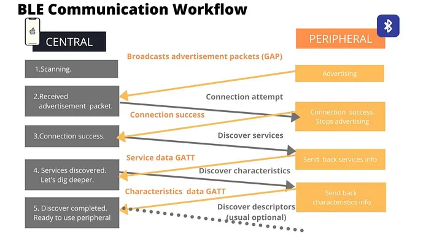
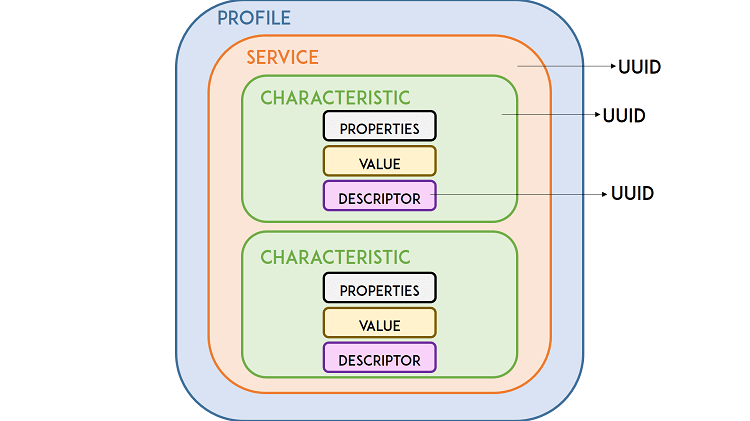

# Bluetooth Low Energy (BLE)

## 1. Learning Outcomes

1. Distinguish **Bluetooth Classic** from **Bluetooth Low Energy (BLE)** based on use case, power consumption, and communication model.
2. Identify the roles of **central** and **peripheral** in a BLE system.
3. Explain how **advertising**, **scanning**, **connecting**, **services**, and **characteristics** are related.
4. Build and flash a BLE peripheral application on the **ESP32-C6**.
5. Use a **Windows PC** to discover a BLE device, inspect its GATT structure, and read a characteristic value.
6. Assemble a complete BLE example from code segments and explain the purpose of each section.

---

## 2. Why BLE 

BLE is a short-range wireless technology designed for embedded devices that need to exchange relatively small amounts of data while keeping power consumption low.

BLE is commonly used in:

- wearable devices
- wireless sensors
- local configuration interfaces
- smart locks
- beacons
- portable instruments
- industrial handheld interfaces

For embedded systems, BLE is attractive because it allows a microcontroller to interact directly with a nearby computer, tablet, or phone without requiring a router or full IP network configuration.

---

## 3. Bluetooth Classic vs BLE

Although both belong to the Bluetooth family, they are designed for different purposes.

| Feature | Bluetooth Classic | BLE |
|---|---:|---:|
| Main use | Audio, continuous streaming | Sensors, control, small data exchange |
| Power consumption | Higher | Lower |
| Communication style | More continuous | Event-based, short packets |
| Common embedded application | Less common | Very common |
| Typical examples | Speakers, headphones | Sensors, tags, wearables, smart controls |

### Key idea
BLE is not simply “Bluetooth but slower.” BLE is designed around **discovery**, **attributes**, and **efficient short data exchanges**.

---

## 4. BLE Roles

### Peripheral
A **peripheral** is usually the embedded device. It advertises its presence and exposes data or control points.

Examples:

- ESP32-C6 sensor node
- wearable heart-rate monitor
- BLE thermometer
- smart lock

### Central
A **central** scans for nearby peripherals, selects one, and initiates a connection.

Examples:

- Windows laptop
- tablet
- smartphone
- commissioning tool

### In this class
- **ESP32-C6** -> Peripheral  
- **Windows PC** -> Central


---

## 5. BLE Communication Sequence



A typical BLE interaction follows this order:

1. The peripheral starts **advertising**.
2. The central starts **scanning**.
3. The central detects the peripheral.
4. The central optionally **connects**.
5. The central reads, writes, or subscribes to characteristics.

### Important distinction
- **Advertising** means “I am here.”
- **Connection** means “let us exchange structured data.”

A device can be visible in a scanner even when no connection exists.

---

## 6. UUIDs in BLE

Before studying the GATT structure in detail, it is necessary to understand how BLE identifies each element inside a device. In Bluetooth Low Energy, **services**, **characteristics**, and **descriptors** are identified using **UUIDs**.

**UUID** stands for **Universally Unique Identifier**. It is a numeric identifier that allows one BLE element to be distinguished from another. In practice, a UUID works as the unique name of a service or characteristic.

BLE uses UUIDs so that a central device can recognize what kind of data or function is being offered by a peripheral. For example, a peripheral may expose a standard battery service, a temperature characteristic, or a custom LED control characteristic. Each of these is identified by a different UUID.

### Why UUIDs are important

UUIDs are important because they allow:
- a central device to discover what services exist in a peripheral
- an application to identify which characteristic contains the desired data
- interoperability when using standardized BLE services
- developers to define their own custom data models without conflicting with other devices

### Types of UUIDs in BLE

BLE commonly uses two UUID formats:

#### 16-bit UUID
These are short UUIDs typically assigned to **standardized services and characteristics** defined by the Bluetooth SIG.

Example:
- `0x180F` → Battery Service
- `0x2A19` → Battery Level Characteristic

These identifiers are compact because they belong to the official Bluetooth-assigned set.

#### 128-bit UUID
These are long UUIDs typically used for **custom services and custom characteristics** created by developers.

Example:
- `12345678-1234-1234-1234-1234567890AB`

These are used when the application needs a data structure that is not part of the official BLE standard.

### Practical interpretation

When a BLE scanner or central device connects to a peripheral, it reads the available services and characteristics by their UUIDs.

- If the UUID is **standard**, the central may already know what it means.
- If the UUID is **custom**, the central application must be programmed to interpret it.

For example:
- a standard **Battery Service UUID** tells the central that the peripheral exposes battery information
- a custom **LED Control Characteristic UUID** tells the central that the device includes a user-defined function, but the meaning depends on the application design

### Relationship between UUID and GATT

In the GATT model:
- each **service** has a UUID
- each **characteristic** has a UUID
- each **descriptor** also has a UUID

This means that UUIDs are the identifiers that allow the central to navigate the BLE data structure.

## 7. GATT: The BLE Data Model



Once a connection is established, BLE commonly uses the **Generic Attribute Profile (GATT)**.

### Service
A **service** groups related information or functionality.

Examples:

- battery service
- environmental sensing service
- custom sensor service

### Characteristic
A **characteristic** is a specific data item or control point inside a service.

Examples:

- temperature value
- device status text
- LED control byte
- sensor configuration parameter

### Descriptor

A **descriptor** adds metadata or configuration related to a characteristic.

### Characteristic properties
A characteristic may support one or more of the following:

- **Read**: central reads the value
- **Write**: central writes a value
- **Notify**: peripheral sends updates to a subscribed central

### Mental model
- **Service** = folder
- **Characteristic** = file
- **Property** = allowed action on that file

---

## 8. ESP32-C6 BLE Application Structure

At the application level, a BLE peripheral on the ESP32-C6 typically contains:

1. BLE stack initialization
2. Device name configuration
3. GAP configuration for advertising
4. GATT database definition
5. One or more services
6. One or more characteristics
7. Event handling for connection and data access

We shoul not try to memorize every API call, but to understand:

- where the BLE stack starts
- where the service is defined
- where the characteristic is defined
- where the advertisement starts
- how the PC later discovers and reads that information

---

## 9. Lab Objective

By the end of this lab, your ESP32-C6 will:

- Advertise the device name **ESP32C6_BLE_DEMO**
- Expose one custom BLE service (UUID `0x00FF`)
- Expose one readable characteristic (UUID `0xFF01`) inside that service
- Return the text `"Hello from ESP32-C6"` when a Windows PC reads it

You will verify all of this using **Bluetooth LE Explorer** on a Windows PC.

---

## 10. Hardware and Software

### Hardware
- ESP32-C6 DevKit
- USB cable
- Windows laptop or desktop with BLE support

### Software
- VS Code
- ESP-IDF
- Serial monitor
- Bluetooth LE Explorer for Windows

---

## 11. Lab Code

The full code is in [Full Code](#12-complete-lab-code). Here we break it down piece by piece so you understand what each part does.

---

## 11.1 Segment 1 — Headers, tag, and constants

This first section includes the required headers and defines names and UUIDs.

```c
#include <stdio.h>
#include <string.h>
#include "freertos/FreeRTOS.h"
#include "freertos/task.h"
#include "esp_log.h"
#include "nvs_flash.h"
#include "esp_bt.h"
#include "esp_gap_ble_api.h"
#include "esp_gatts_api.h"
#include "esp_bt_main.h"
#include "esp_gatt_common_api.h"

static const char *TAG = "BLE_DEMO";

#define DEVICE_NAME              "ESP32C6_BLE_DEMO"
#define GATTS_SERVICE_UUID_TEST  0x00FF
#define GATTS_CHAR_UUID_TEST     0xFF01
#define GATTS_NUM_HANDLE_TEST    4
#define PROFILE_NUM              1
#define PROFILE_APP_IDX          0
#define ESP_APP_ID               0x55

static const char char_value[] = "Hello from ESP32-C6";
```

### What this section does
- imports BLE and system libraries
- defines the device name that will appear in the scanner
- defines one service UUID and one characteristic UUID
- defines the text value that the PC will later read

| Name | Purpose |
|------|---------|
| `TAG` | Label for log messages, helps you filter output in the serial monitor |
| `DEVICE_NAME` | The name scanners will see when they discover your device |
| `GATTS_SERVICE_UUID_TEST` (`0x00FF`) | Unique identifier for our custom service |
| `GATTS_CHAR_UUID_TEST` (`0xFF01`) | Unique identifier for the characteristic inside the service |
| `GATTS_NUM_HANDLE_TEST` (`4`) | How many handle slots the BLE stack should reserve (service + characteristic + descriptor typically needs 4) |
| `char_value` | The actual text that gets returned when a central reads the characteristic |

> You don't need to memorize these UUIDs, just know that both the service and characteristic need one, and they must match what the central looks for.

---

## 11.2 Segment 2 — Advertisement data

This section defines the BLE advertisement content.This section has two structs that control advertising: **what** you broadcast and **how** you broadcast it.

```c
static esp_ble_adv_data_t adv_data = {
    .set_scan_rsp = false,
    .include_name = true,
    .include_txpower = false,
    .min_interval = 0x20,
    .max_interval = 0x40,
    .appearance = 0x00,
    .manufacturer_len = 0,
    .p_manufacturer_data = NULL,
    .service_data_len = 0,
    .p_service_data = NULL,
    .service_uuid_len = 0,
    .p_service_uuid = NULL,
    .flag = ESP_BLE_ADV_FLAG_GEN_DISC | ESP_BLE_ADV_FLAG_BREDR_NOT_SPT,
};

static esp_ble_adv_params_t adv_params = {
    .adv_int_min = 0x20,
    .adv_int_max = 0x40,
    .adv_type = ADV_TYPE_IND,
    .own_addr_type = BLE_ADDR_TYPE_PUBLIC,
    .channel_map = ADV_CHNL_ALL,
    .adv_filter_policy = ADV_FILTER_ALLOW_SCAN_ANY_CON_ANY,
};
```

### What this section does
- configures the advertising packet
- includes the device name in the advertisement
- sets general discoverable mode
- prepares parameters for starting BLE advertising


**The two structs explained:**

| Struct | Role | Analogy |
|--------|------|---------|
| `adv_data` (the payload) | What bytes get broadcast, the device name, flags, and discovery mode. This is what scanners read *before* connecting. | The text on your shop sign |
| `adv_params` (radio behavior) | How often to advertise, which channels to use, and who can connect. | The brightness and placement of your sign |

**Key flags:**

- `GEN_DISC` = "general discoverable" any scanner can find this device
- `BREDR_NOT_SPT` = tells scanners this is BLE only (no classic Bluetooth)

This section also declares the **handle variables** that the BLE stack will fill in later:


```c
static uint16_t service_handle;
static esp_gatt_char_prop_t char_property = ESP_GATT_CHAR_PROP_BIT_READ;
static uint16_t char_handle;
static esp_gatt_if_t gatts_if_for_profile = 0;
```

> **What are "handles"?** When the BLE stack creates your service and characteristic, it assigns them numeric handles — like row numbers in a database. You store them so you can refer to those items later. `char_property = ESP_GATT_CHAR_PROP_BIT_READ` tells the stack this characteristic is **read-only**.

---

## 11.3 Segment 4 — GAP event handler

This function reacts to advertising-related events. It's short but critical, it actually starts the radio broadcasting.

```c
static void gap_event_handler(esp_gap_ble_cb_event_t event, esp_ble_gap_cb_param_t *param)
{
    switch (event) {
    case ESP_GAP_BLE_ADV_DATA_SET_COMPLETE_EVT:
        esp_ble_gap_start_advertising(&adv_params);
        break;

    case ESP_GAP_BLE_ADV_START_COMPLETE_EVT:
        if (param->adv_start_cmpl.status == ESP_BT_STATUS_SUCCESS) {
            ESP_LOGI(TAG, "Advertising started successfully");
        } else {
            ESP_LOGE(TAG, "Advertising start failed");
        }
        break;

    default:
        break;
    }
}
```

**Workflow:**

1. Elsewhere in the code, `esp_ble_gap_config_adv_data()` is called, which configures the advertising packet.
2. When that finishes, the stack fires `ADV_DATA_SET_COMPLETE_EVT`. Our handler catches it and calls `esp_ble_gap_start_advertising()`.
3. When advertising actually starts, the stack fires `ADV_START_COMPLETE_EVT`. We log success or failure.

> This is the **first visible sign** in your serial monitor that BLE is working. Look for **"Advertising started successfully"**.

---

## 11.5 Segment 5 — GATT event handler

This is the biggest and most important function. It creates the service, creates the characteristic, and handles connections and disconnections.

```c
static void gatts_profile_event_handler(esp_gatts_cb_event_t event,
                                        esp_gatt_if_t gatts_if,
                                        esp_ble_gatts_cb_param_t *param)
{
    switch (event) {
    case ESP_GATTS_REG_EVT:
        ESP_LOGI(TAG, "GATT server registered");
        gatts_if_for_profile = gatts_if;

        esp_ble_gap_set_device_name(DEVICE_NAME);
        esp_ble_gap_config_adv_data(&adv_data);

        esp_gatt_srvc_id_t service_id = {
            .is_primary = true,
            .id.inst_id = 0x00,
            .id.uuid.len = ESP_UUID_LEN_16,
            .id.uuid.uuid.uuid16 = GATTS_SERVICE_UUID_TEST,
        };

        esp_ble_gatts_create_service(gatts_if, &service_id, GATTS_NUM_HANDLE_TEST);
        break;

    case ESP_GATTS_CREATE_EVT:
        ESP_LOGI(TAG, "Service created");
        service_handle = param->create.service_handle;
        esp_ble_gatts_start_service(service_handle);

        esp_bt_uuid_t char_uuid = {
            .len = ESP_UUID_LEN_16,
            .uuid.uuid16 = GATTS_CHAR_UUID_TEST,
        };

        esp_attr_value_t char_val = {
            .attr_max_len = sizeof(char_value),
            .attr_len = strlen(char_value),
            .attr_value = (uint8_t *)char_value,
        };

        esp_ble_gatts_add_char(service_handle,
                               &char_uuid,
                               ESP_GATT_PERM_READ,
                               char_property,
                               &char_val,
                               NULL);
        break;

    case ESP_GATTS_ADD_CHAR_EVT:
        ESP_LOGI(TAG, "Characteristic added");
        char_handle = param->add_char.attr_handle;
        break;

    case ESP_GATTS_CONNECT_EVT:
        ESP_LOGI(TAG, "Central connected");
        break;

    case ESP_GATTS_DISCONNECT_EVT:
        ESP_LOGI(TAG, "Central disconnected, restarting advertising");
        esp_ble_gap_start_advertising(&adv_params);
        break;

    default:
        break;
    }
}
```

### What this section does
- registers the device name
- creates the BLE service
- starts the service
- creates one readable characteristic
- restarts advertising after a disconnect

**The event chain**

```
REG_EVT                    CREATE_EVT                ADD_CHAR_EVT
  │                           │                          │
  ├─ Set device name          ├─ Store service handle    └─ Store char handle
  ├─ Configure adv data       ├─ Start the service          (Done)
  └─ Create service ──────►   └─ Add characteristic ──►
```

**Why restart advertising on disconnect?** When a central connects, the ESP32 stops advertising (it's busy with the connection). When the central disconnects, you need to explicitly restart advertising so other devices can find your ESP32 again. Without this, the device goes "invisible" after the first disconnection.

#### Global Dispatcher

ESP-IDF uses a two-layer callback pattern. This global handler receives all GATT events and forwards them to your profile handler:

```c
static void gatts_event_handler(esp_gatts_cb_event_t event,
                                esp_gatt_if_t gatts_if,
                                esp_ble_gatts_cb_param_t *param)
{
    if (event == ESP_GATTS_REG_EVT) {
        if (param->reg.status == ESP_GATT_OK) {
            gatts_if_for_profile = gatts_if;
        } else {
            ESP_LOGE(TAG, "GATT app register failed: %d", param->reg.status);
            return;
        }
    }

    gatts_profile_event_handler(event, gatts_if, param);
}
```

### What this section does
- receives GATT events from the BLE stack
- forwards them to the profile-specific event handler

---

## 11.6 Segment 6 — `app_main()` initialization

This final section initializes NVS, Bluetooth, BLE callbacks, and the GATT server application.

```c
void app_main(void)
{
    esp_err_t ret;

    ret = nvs_flash_init();
    if (ret == ESP_ERR_NVS_NO_FREE_PAGES || ret == ESP_ERR_NVS_NEW_VERSION_FOUND) {
        ESP_ERROR_CHECK(nvs_flash_erase());
        ret = nvs_flash_init();
    }
    ESP_ERROR_CHECK(ret);

    ESP_ERROR_CHECK(esp_bt_controller_mem_release(ESP_BT_MODE_CLASSIC_BT));

    esp_bt_controller_config_t bt_cfg = BT_CONTROLLER_INIT_CONFIG_DEFAULT();
    ESP_ERROR_CHECK(esp_bt_controller_init(&bt_cfg));
    ESP_ERROR_CHECK(esp_bt_controller_enable(ESP_BT_MODE_BLE));

    ESP_ERROR_CHECK(esp_bluedroid_init());
    ESP_ERROR_CHECK(esp_bluedroid_enable());

    ESP_ERROR_CHECK(esp_ble_gap_register_callback(gap_event_handler));
    ESP_ERROR_CHECK(esp_ble_gatts_register_callback(gatts_event_handler));
    ESP_ERROR_CHECK(esp_ble_gatts_app_register(ESP_APP_ID));

    ESP_ERROR_CHECK(esp_ble_gatt_set_local_mtu(500));

    ESP_LOGI(TAG, "BLE initialization complete");
}
```

### What this section does
- initializes non-volatile storage
- enables the BLE controller
- initializes the Bluetooth stack
- registers GAP and GATT callbacks
- registers the GATT application
- finishes BLE startup

---

## 12. Complete Lab Code

```c
#include <stdio.h>
#include <string.h>
#include "freertos/FreeRTOS.h"
#include "freertos/task.h"
#include "esp_log.h"
#include "nvs_flash.h"
#include "esp_bt.h"
#include "esp_gap_ble_api.h"
#include "esp_gatts_api.h"
#include "esp_bt_main.h"
#include "esp_gatt_common_api.h"

static const char *TAG = "BLE_DEMO";

#define DEVICE_NAME              "ESP32C6_BLE_DEMO"
#define GATTS_SERVICE_UUID_TEST  0x00FF
#define GATTS_CHAR_UUID_TEST     0xFF01
#define GATTS_NUM_HANDLE_TEST    4
#define PROFILE_NUM              1
#define PROFILE_APP_IDX          0
#define ESP_APP_ID               0x55

static const char char_value[] = "Hello from ESP32-C6";

static uint16_t service_handle;
static esp_gatt_char_prop_t char_property = ESP_GATT_CHAR_PROP_BIT_READ;
static uint16_t char_handle;
static esp_gatt_if_t gatts_if_for_profile = 0;

static esp_ble_adv_data_t adv_data = {
    .set_scan_rsp = false,
    .include_name = true,
    .include_txpower = false,
    .min_interval = 0x20,
    .max_interval = 0x40,
    .appearance = 0x00,
    .manufacturer_len = 0,
    .p_manufacturer_data = NULL,
    .service_data_len = 0,
    .p_service_data = NULL,
    .service_uuid_len = 0,
    .p_service_uuid = NULL,
    .flag = ESP_BLE_ADV_FLAG_GEN_DISC | ESP_BLE_ADV_FLAG_BREDR_NOT_SPT,
};

static esp_ble_adv_params_t adv_params = {
    .adv_int_min = 0x20,
    .adv_int_max = 0x40,
    .adv_type = ADV_TYPE_IND,
    .own_addr_type = BLE_ADDR_TYPE_PUBLIC,
    .channel_map = ADV_CHNL_ALL,
    .adv_filter_policy = ADV_FILTER_ALLOW_SCAN_ANY_CON_ANY,
};

static void gap_event_handler(esp_gap_ble_cb_event_t event, esp_ble_gap_cb_param_t *param)
{
    switch (event) {
    case ESP_GAP_BLE_ADV_DATA_SET_COMPLETE_EVT:
        esp_ble_gap_start_advertising(&adv_params);
        break;

    case ESP_GAP_BLE_ADV_START_COMPLETE_EVT:
        if (param->adv_start_cmpl.status == ESP_BT_STATUS_SUCCESS) {
            ESP_LOGI(TAG, "Advertising started successfully");
        } else {
            ESP_LOGE(TAG, "Advertising start failed");
        }
        break;

    default:
        break;
    }
}

static void gatts_profile_event_handler(esp_gatts_cb_event_t event,
                                        esp_gatt_if_t gatts_if,
                                        esp_ble_gatts_cb_param_t *param)
{
    switch (event) {
    case ESP_GATTS_REG_EVT:
        ESP_LOGI(TAG, "GATT server registered");
        gatts_if_for_profile = gatts_if;

        esp_ble_gap_set_device_name(DEVICE_NAME);
        esp_ble_gap_config_adv_data(&adv_data);

        esp_gatt_srvc_id_t service_id = {
            .is_primary = true,
            .id.inst_id = 0x00,
            .id.uuid.len = ESP_UUID_LEN_16,
            .id.uuid.uuid.uuid16 = GATTS_SERVICE_UUID_TEST,
        };

        esp_ble_gatts_create_service(gatts_if, &service_id, GATTS_NUM_HANDLE_TEST);
        break;

    case ESP_GATTS_CREATE_EVT:
        ESP_LOGI(TAG, "Service created");
        service_handle = param->create.service_handle;
        esp_ble_gatts_start_service(service_handle);

        esp_bt_uuid_t char_uuid = {
            .len = ESP_UUID_LEN_16,
            .uuid.uuid16 = GATTS_CHAR_UUID_TEST,
        };

        esp_attr_value_t char_val = {
            .attr_max_len = sizeof(char_value),
            .attr_len = strlen(char_value),
            .attr_value = (uint8_t *)char_value,
        };

        esp_attr_control_t char_control = {
            .auto_rsp = ESP_GATT_AUTO_RSP,
        };

        esp_ble_gatts_add_char(service_handle,
                            &char_uuid,
                            ESP_GATT_PERM_READ,
                            char_property,
                            &char_val,
                            &char_control); 
        break;

    case ESP_GATTS_ADD_CHAR_EVT:
        ESP_LOGI(TAG, "Characteristic added");
        char_handle = param->add_char.attr_handle;
        break;

    case ESP_GATTS_CONNECT_EVT:
        ESP_LOGI(TAG, "Central connected");
        break;

    case ESP_GATTS_DISCONNECT_EVT:
        ESP_LOGI(TAG, "Central disconnected, restarting advertising");
        esp_ble_gap_start_advertising(&adv_params);
        break;

    default:
        break;
    }
}

static void gatts_event_handler(esp_gatts_cb_event_t event,
                                esp_gatt_if_t gatts_if,
                                esp_ble_gatts_cb_param_t *param)
{
    if (event == ESP_GATTS_REG_EVT) {
        if (param->reg.status == ESP_GATT_OK) {
            gatts_if_for_profile = gatts_if;
        } else {
            ESP_LOGE(TAG, "GATT app register failed: %d", param->reg.status);
            return;
        }
    }

    gatts_profile_event_handler(event, gatts_if, param);
}

void app_main(void)
{
    esp_err_t ret;

    ret = nvs_flash_init();
    if (ret == ESP_ERR_NVS_NO_FREE_PAGES || ret == ESP_ERR_NVS_NEW_VERSION_FOUND) {
        ESP_ERROR_CHECK(nvs_flash_erase());
        ret = nvs_flash_init();
    }
    ESP_ERROR_CHECK(ret);

    ESP_ERROR_CHECK(esp_bt_controller_mem_release(ESP_BT_MODE_CLASSIC_BT));

    esp_bt_controller_config_t bt_cfg = BT_CONTROLLER_INIT_CONFIG_DEFAULT();
    ESP_ERROR_CHECK(esp_bt_controller_init(&bt_cfg));
    ESP_ERROR_CHECK(esp_bt_controller_enable(ESP_BT_MODE_BLE));

    ESP_ERROR_CHECK(esp_bluedroid_init());
    ESP_ERROR_CHECK(esp_bluedroid_enable());

    ESP_ERROR_CHECK(esp_ble_gap_register_callback(gap_event_handler));
    ESP_ERROR_CHECK(esp_ble_gatts_register_callback(gatts_event_handler));
    ESP_ERROR_CHECK(esp_ble_gatts_app_register(ESP_APP_ID));

    ESP_ERROR_CHECK(esp_ble_gatt_set_local_mtu(500));

    ESP_LOGI(TAG, "BLE initialization complete");
}
```

---

## 13. Lab Procedure


### 13.1 Flashing 
1. Create or open the ESP-IDF project.
2. Replace `main.c` with the complete code.
3. Build and flash the project to the ESP32-C6.
4. Open the serial monitor.
5. Confirm that the log shows BLE initialization and advertising.


### 13.2 Windows PC Discovery

1. Open **Bluetooth LE Explorer** on your Windows PC.
2. Click **Start** to begin scanning for BLE devices.
3. Look for **ESP32C6_BLE_DEMO** in the device list.
4. Click on the device to connect and explore services.
5. Find the custom service with UUID `0x00FF`.
6. Inside the service, find the characteristic with UUID `0xFF01`.
7. Click **Read** on the characteristic.
8. Confirm the value is **"Hello from ESP32-C6"**.

---

## 14. Verification Checkpoints

A correct lab result must include all of the following:

- the ESP32-C6 boots correctly
- BLE initializes without errors
- advertising starts successfully
- the Windows PC discovers the device
- the custom service appears in Bluetooth LE Explorer
- the readable characteristic appears correctly
- the characteristic value is read successfully

---

## 15. Evidence Required in the Technical Log

Each team must document the following:

1. **Screenshot** of the serial monitor showing BLE startup messages.
2. **Screenshot** of Bluetooth LE Explorer showing the discovered device.
3. **Screenshot** showing the service and characteristic.
4. **Screenshot or note** of the characteristic value read result.
5. **Brief written explanation** (a few sentences each) of:
   - What is the difference between a central and a peripheral?
   - What is the difference between a service and a characteristic?
   - Why is BLE suitable for this type of application?


---


