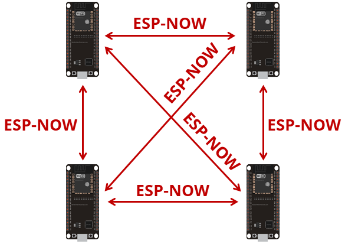

# ESP-NOW

## Part 1 — ESP-NOW Theory

---

### 1.1 What is ESP-NOW and why use it?

ESP-NOW is a **connectionless, peer-to-peer wireless communication protocol**
developed by Espressif for the ESP32 family. It lets two or more boards
exchange small packets of data directly — without a Wi-Fi router, without an
IP address, and without any connection handshake.

Think of it like walkie-talkies: you press the button and the other side
hears you immediately, with no phone network in between.

**When ESP-NOW is the right tool:**

| Situation | Why ESP-NOW fits |
|---|---|
| You need very low latency (< 5 ms) | No connection overhead, no TCP/IP stack |
| No Wi-Fi router is available | Works standalone, no AP needed |
| Your network has ≤ 20 nodes | Peer limit is 20, which covers most embedded projects |
| You are sending small, frequent packets | Optimized for up to 250 bytes per frame |
| Battery-powered sensor → gateway | Can wake, send one packet, and sleep again |
| Remote control, robotics, telemetry | Low latency and direct addressing |

**When to look elsewhere:**

| Situation | Better option |
|---|---|
| > 20 nodes that need to mesh | Zigbee or Thread |
| Devices need internet access | Wi-Fi + MQTT or HTTP |
| Very long range (> 300 m) | LoRa |
| Deep sleep sensors on coin cell | Zigbee end device |

---

### 1.2 How it works

ESP-NOW runs on the **2.4 GHz Wi-Fi radio** — the same physical hardware
used for normal Wi-Fi — but it bypasses the entire Wi-Fi networking stack.
There is no DHCP, no IP address, no TCP or UDP, and no association with an
access point. The ESP-NOW driver lives just above the MAC (hardware) layer.

```
Normal Wi-Fi path:
  App → TCP/IP stack → Wi-Fi MAC → Radio     (slow, lots of overhead)

ESP-NOW path:
  App → ESP-NOW driver → Wi-Fi MAC → Radio   (fast, minimal overhead)
```

The API is entirely **callback-driven**. You register two functions:

```
on_data_sent(mac, status)         ← called after you send, tells you if it worked
on_data_recv(info, data, len)     ← called when a packet arrives
```

Both callbacks fire from the **Wi-Fi driver's internal task** — a background
thread managed by the ESP-IDF framework. This has an important consequence:
you must never do heavy work or blocking calls inside them. The correct
pattern is to copy the data into a queue and process it from your own task.

---

### 1.3 What is a peer?

A **peer** is any remote device that your board is allowed to communicate
with directly. Before you can send data to another board, you must
**register** it as a peer by telling the ESP-NOW driver its MAC address.

This registration step is mandatory because the driver needs to know,
per destination:

- Which **Wi-Fi channel** to use
- Which **network interface** to use (station or access point)
- Whether to apply **encryption** and which key to use

Think of it like adding a contact to a messaging app before you can send
them a message. The MAC address is the "phone number".

```
Before registering:                  After registering:
───────────────────                  ──────────────────────────────────────────
Board A knows nothing                Board A has a peer record for Board B:
about Board B             →            - B's MAC address
                                       - channel to use
                                       - encryption settings
                                     Board A can now call esp_now_send()
```

A peer record lives **only in RAM** — it is lost when the board reboots.
You must call `esp_now_add_peer()` every time the board starts up.

**Key peer rules:**

| Rule | Detail |
|---|---|
| Maximum peers | 20 total (encrypted + unencrypted combined) |
| Registration is not automatic | Both sides must register each other for two-way communication |
| Survives only while powered | Must re-register after every reboot |
| Broadcast MAC also needs registration | Register `FF:FF:FF:FF:FF:FF` as a peer to broadcast |
| Receiving does not require registration | A board can receive from anyone without registering them |

---

### 1.4 Communication patterns

ESP-NOW does not have fixed "roles" like coordinator or end device. Any
board can be a sender, receiver, or both at the same time. Four common
patterns:



#### One-to-one (unicast)

```
[Board A] ──────────────────► [Board B]
             to B's MAC
```

The simplest case. Board A registers B as a peer and sends to B's MAC.
If bidirectional, B also registers A and can reply.
Modules 1, 2, and 3 use this pattern.

#### One-to-many

```
              ┌─► [Board B]
[Board A] ────┼─► [Board C]
              └─► [Board D]
```

Board A registers B, C, and D as separate peers and sends individual
packets to each — or sends one broadcast that all three receive.
Useful for: one controller driving multiple actuators.

#### Many-to-one

```
[Board B] ─┐
[Board C] ─┼──► [Board A]  (gateway / aggregator)
[Board D] ─┘
```

Each sensor registers the gateway's MAC and sends to it.
The gateway's receive callback fires for every incoming packet — the
`src_addr` field in the callback tells you which board sent each packet.
Useful for: collecting sensor readings from multiple nodes into one display.

#### Two-way (symmetric)

```
[Board A] ◄──────────────► [Board B]
          both register each other
          both have send + receive callbacks
```

Both boards register each other as peers and both have send and receive
callbacks registered. 

---

### 1.5 Structuring your data — the packed struct

ESP-NOW gives you a raw byte buffer of up to 250 bytes. You could send a
plain string, but in real projects you almost always want to send multiple
values of different types together — a reading, a command type, a timestamp.

The standard approach is to define a **C struct** and send its bytes directly:

```c
// Define a packet with multiple fields
typedef struct {
    uint8_t  type;       // what kind of message this is
    uint8_t  seq;        // sequence number for ordering / dedup
    int16_t  value;      // a signed integer (e.g. temperature in 0.01 °C)
    float    voltage;    // a floating-point reading
    bool     flag;       // a boolean state
    char     text[32];   // a short string
} __attribute__((packed)) espnow_pkt_t;

// Sending:
espnow_pkt_t pkt = { .type = 1, .value = 2350, .voltage = 3.3f };
esp_now_send(peer_mac, (uint8_t *)&pkt, sizeof(pkt));

// Receiving (inside on_data_recv):
espnow_pkt_t received;
memcpy(&received, data, sizeof(received));   // copy raw bytes into the struct
```

#### Why `__attribute__((packed))`?

By default, the C compiler inserts **padding bytes** between struct fields
to align them in memory for performance. This is invisible when running on
one machine, but breaks binary communication between two boards, because
each compiler may choose different padding amounts.

`__attribute__((packed))` tells the compiler: *lay the fields out exactly
as written, byte by byte, with no padding.* This guarantees that the byte
sequence the sender writes is identical to what the receiver reads.

```
Without packed:                    With packed:
┌──────┬──────┬──────┬──────┐     ┌──────┬──────┬──────────┬──────────┐
│ type │  ?   │ seq  │  ?   │     │ type │ seq  │ value_lo │ value_hi │ ...
│  1 B │ pad  │  1 B │ pad  │     │  1 B │  1 B │    2 B (int16)      │
└──────┴──────┴──────┴──────┘     └──────┴──────┴──────────┴──────────┘
  compiler decides the gaps          no gaps — safe for binary transfer
```

---

### 1.6 The four essential API functions

| Function | What it does |
|---|---|
| `esp_now_init()` | Initializes the ESP-NOW driver. Wi-Fi must be started first. |
| `esp_now_add_peer(&peer_info)` | Registers a peer device by MAC address. Required before sending to that device. |
| `esp_now_send(mac, data, len)` | Sends up to 250 bytes to a registered peer. Returns immediately — actual delivery result arrives in the send callback. |
| `esp_now_register_send_cb(fn)` | Registers your send callback. Called after each send with `ESP_NOW_SEND_SUCCESS` or `ESP_NOW_SEND_FAIL`. often named `OnDataSent` |
| `esp_now_register_recv_cb(fn)` | Registers your receive callback. Called every time a packet arrives from any peer, often named `OnDataReceived`. |

> `esp_now_send()` is **non-blocking** — it queues the packet and returns
> immediately. The actual transmission happens in the background, and the
> result is delivered to your `on_data_sent` callback asynchronously.

**Typical return values:**

1. `ESP_OK` — the packet was accepted for transmission (not a guarantee of delivery) the `on_data_sent` callback will be the one to tell you if it actually got there or not.
2. `ESP_ERR_ESPNOW_NOT_INIT` — you forgot to call `esp_now_init()`
3. `ESP_ERR_ESPNOW_ARG` — invalid argument (e.g. null pointer, zero length)
4. `ESP_ERR_ESPNOW_NO_MEM` — out of memory (e.g. peer list full)
5. `ESP_ERR_ESPNOW_NOT_FOUND` — peer MAC not found in the registered peer list
6. `ESP_ERR_ESPNOW_INTERNAL` — internal error in the driver (rare)
7. `ESP_ERR_ESPNOW_BUSY` — driver is busy (e.g. too many pending packets, or Wi-Fi is scanning)
8. `ESP_ERR_ESPNOW_TIMEOUT` — operation timed out (e.g. waiting for ACK after send)


---

### 1.7 Key limitations

| Limitation | Value | Notes |
|---|---|---|
| Max payload | 250 bytes | Plan your struct to fit |
| Max total peers | 20 | Includes encrypted peers |
| Max encrypted peers (station mode) | 10 | Unencrypted peers fill the rest |
| No delivery confirmation for broadcast | — | Broadcast has no ACK mechanism |
| No mesh routing | — | Packets travel one hop only — no automatic re-routing |
| Peer list lost on reboot | — | Must call `add_peer()` again after every restart |

---

## Part 2 — Hands-on Lab

---

### Lab 0 — Setup and reading your MAC address

We should have two ESP32-C6 boards on hand for this lab, which we will call **Board A** and **Board B**.

#### 0.1 Project folder structure

```
espnow_lab/
├── board_a/
│   ├── CMakeLists.txt
│   ├── sdkconfig.defaults
│   └── main/
│       ├── CMakeLists.txt
│       └── board_a.c
└── board_b/
    ├── CMakeLists.txt
    ├── sdkconfig.defaults
    └── main/
        ├── CMakeLists.txt
        └── board_b.c
```


#### 0.2 sdkconfig.defaults

This are by default on any new ESP-IDF template project. But double-check that they are present in both `board_a/` and `board_b/` folders. If not, create them with the content below. 
```ini
# ESP-NOW uses the Wi-Fi radio — no extra protocol stack config required
CONFIG_ESP_WIFI_ENABLED=y
CONFIG_FREERTOS_HZ=1000
```

#### 0.3 Read your board's MAC address

Flash this sketch on **each board** and note the MAC address printed on the
serial monitor. You will hardcode both addresses in the shared header
starting in Module 1.

```c
// main/board_a.c  (Module 0 — MAC reader)
#include <stdio.h>
#include "esp_log.h"
#include "esp_wifi.h"
#include "nvs_flash.h"
#include "esp_event.h"

static const char *TAG = "MAC_READER";

void app_main(void)
{
    ESP_ERROR_CHECK(nvs_flash_init());
    ESP_ERROR_CHECK(esp_event_loop_create_default());

    wifi_init_config_t wifi_cfg = WIFI_INIT_CONFIG_DEFAULT();
    ESP_ERROR_CHECK(esp_wifi_init(&wifi_cfg));
    ESP_ERROR_CHECK(esp_wifi_set_mode(WIFI_MODE_STA));
    ESP_ERROR_CHECK(esp_wifi_start());

    uint8_t mac[6];
    ESP_ERROR_CHECK(esp_wifi_get_mac(WIFI_IF_STA, mac));

    ESP_LOGI(TAG, "Board MAC: %02X:%02X:%02X:%02X:%02X:%02X",
             mac[0], mac[1], mac[2], mac[3], mac[4], mac[5]);
}
```


Dont forget to change the target and the port for each board when flashing:

```bash
idf.py set-target esp32c6
idf.py build flash monitor -p COM3
```

**Expected output:**

```
I (567) wifi:mode : sta (f0:f5:bd:02:f1:9c)
I (567) wifi:enable tsf
I (567) MAC_READER: Board MAC: F0:F5:BD:02:F1:9C
I (577) main_task: Returned from app_main()
```

Flash on Board B as well and note its different MAC. Write both down.


---

## Module 1 — One-way message

**Goal:** Board A sends the string `"HELLO #N"` every 2 seconds.
Board B receives it and prints it to the serial monitor.

**Sender checklist (Board A):**

1. Initialize NVS → Wi-Fi → ESP-NOW (always in this order)
2. Register the send callback
3. Register Board B as a peer
4. Call `esp_now_send()` in a task loop

**Receiver checklist (Board B):**

1. Initialize NVS → Wi-Fi → ESP-NOW
2. Register the receive callback
3. In the callback, push data to a FreeRTOS queue
4. Process the queue in a dedicated task

### 1.1 Shared header — create inside **both** `main/` folders

```c
// main/espnow_common.h
#pragma once
#include <stdint.h>

// ── Paste the MAC addresses to whom you want to send messages ──────────
#define MAC_BOARD_N   { 0xAA, 0xBB, 0xCC, 0xDD, 0xEE, 0x02 }

// ── Main packet structure ──────────────────────────────────────────────
// __attribute__((packed)) removes compiler padding bytes so the binary
// layout is identical on every board regardless of compiler settings.
// See section 1.5 for a full explanation.
typedef struct {
    uint8_t    seq;        // sequence number: increments 0–255 then wraps
    int16_t    value;      // signed integer payload (e.g. temp in 0.01 °C)
    float      fvalue;     // floating-point payload (e.g. voltage in volts)
    bool       flag;       // boolean state flag
    char       text[32];   // short text payload, must be null-terminated
} __attribute__((packed)) espnow_pkt_t;
```

---

### 1.2 Board A — sender

```c
// board_a/main/board_a.c  (Module 1)
#include <string.h>      // memcpy, memset, strlen — see C reference at end
#include <stdio.h>       // snprintf — see C reference at end
#include "esp_log.h"
#include "esp_wifi.h"
#include "esp_now.h"
#include "esp_event.h"
#include "nvs_flash.h"
#include "freertos/FreeRTOS.h"
#include "freertos/task.h"
#include "espnow_common.h"

static const char *TAG = "BOARD_A";

// Destination MAC — Board B's address noted in Module 0
static uint8_t peer_mac[] = MAC_BOARD_N;

/* ── Send callback ─────────────────────────────────────────────────────
 *
 * The ESP-NOW driver calls this function automatically after each
 * esp_now_send() attempt, once the MAC-layer result is known.
 *
 * Parameters:
 *   tx_info — pointer to transmit metadata from the Wi-Fi driver.
 *             It contains address information
 *             such as the destination MAC (tx_info->des_addr) and source
 *             MAC (tx_info->src_addr).
 *   status  — ESP_NOW_SEND_SUCCESS or ESP_NOW_SEND_FAIL
 *
 * status return values:
 *   ESP_NOW_SEND_SUCCESS → the destination radio acknowledged the frame
 *                          at the MAC layer.
 *   ESP_NOW_SEND_FAIL    → no MAC-layer ACK was received.
 *
 *   A MAC-layer ACK does NOT guarantee that the receiving application
 *   processed the payload. It only means the frame was delivered to the
 *   peer's radio/driver layer.
 *
 * Note:
 *   This callback runs in a high-priority Wi-Fi task. Keep it short.
 *   Do not do lengthy work here; send minimal info to a queue if needed.
 *
 */
static void on_data_sent(const wifi_tx_info_t *tx_info, esp_now_send_status_t status)
{
    if (tx_info && tx_info->des_addr) {
        ESP_LOGI(TAG,
                 "Send to %02X:%02X:%02X:%02X:%02X:%02X -> %s",
                 tx_info->des_addr[0], tx_info->des_addr[1], tx_info->des_addr[2],
                 tx_info->des_addr[3], tx_info->des_addr[4], tx_info->des_addr[5],
                 status == ESP_NOW_SEND_SUCCESS ? "OK" : "FAIL");
    }
}

/* ── ESP-NOW initialization ────────────────────────────────────────────
 *
 * Initialization order matters — each step depends on the previous one:
 *   1. NVS    — Wi-Fi driver stores its calibration data in NVS
 *   2. Wi-Fi  — ESP-NOW uses the Wi-Fi radio hardware
 *   3. ESP-NOW — initialize the protocol driver on top of Wi-Fi
 *   4. Callbacks — register before any send/receive can happen
 *   5. Peers  — register each destination before calling esp_now_send()
 */
static void espnow_init(void)
{
    // Step 1: initialize NVS flash storage
    ESP_ERROR_CHECK(nvs_flash_init());
    ESP_ERROR_CHECK(esp_event_loop_create_default());

    // Step 2: initialize Wi-Fi in station mode.
    // We do not connect to any access point — station mode just enables the 2.4 GHz radio hardware that ESP-NOW operates on.
    wifi_init_config_t wifi_cfg = WIFI_INIT_CONFIG_DEFAULT();
    ESP_ERROR_CHECK(esp_wifi_init(&wifi_cfg));
    ESP_ERROR_CHECK(esp_wifi_set_mode(WIFI_MODE_STA));
    ESP_ERROR_CHECK(esp_wifi_start());

    // Step 3: initialize the ESP-NOW protocol driver
    ESP_ERROR_CHECK(esp_now_init());

    // Step 4: register our send status callback
    ESP_ERROR_CHECK(esp_now_register_send_cb(on_data_sent));

    // Step 5: register Board B as a peer.
    // esp_now_peer_info_t is a struct defined by ESP-IDF that holds everything the driver needs to know about one destination device. We create an instance of it.
    esp_now_peer_info_t BoardB;
    memset(&BoardB, 0, sizeof(BoardB));          // zero all fields first
    memcpy(BoardB.peer_addr, peer_mac, 6);     // copy the 6-byte MAC address
    BoardB.channel = 0;                        // 0 = use the current Wi-Fi channel
    BoardB.ifidx   = WIFI_IF_STA;              // send via the station interface
    BoardB.encrypt = false;                    // no encryption for now

    ESP_ERROR_CHECK(esp_now_add_peer(&BoardB));

    ESP_LOGI(TAG, "ESP-NOW ready. Peer: %02X:%02X:%02X:%02X:%02X:%02X",
             peer_mac[0], peer_mac[1], peer_mac[2],
             peer_mac[3], peer_mac[4], peer_mac[5]);
}

/* ── Sender task ───────────────────────────────────────────────────────
 *
 * Runs in its own FreeRTOS task so the main thread is never blocked.
 * Sends one packet every 2 seconds indefinitely.
 */
static void sender_task(void *pv)
{
    uint8_t seq = 0;
    espnow_pkt_t message;

    while (1) {
        // Zero the entire struct first to avoid sending stale data from previous iterations in any unused fields
        memset(&message, 0, sizeof(message));

        message.seq  = seq++;    // increment; wraps 255 → 0 automatically

        // snprintf writes a formatted string into message.text safely.
        // sizeof(message.text) here, prevents writing past the end of the buffer.
        snprintf(message.text, sizeof(message.text), "HELLO #%d", message.seq);

        ESP_LOGI(TAG, "Sending: \"%s\"", message.text);

        // Cast the struct pointer to uint8_t* in other words raw bytes, esp_now_send treats the payload as raw bytes. sizeof(message) gives the exact byte count.
        esp_err_t ret = esp_now_send(peer_mac,
                                      (uint8_t *)&message,
                                      sizeof(message));
        //ret will show the return from esp_now_send() see 1.6 for possible values and their meaning.
        if (ret != ESP_OK)
            ESP_LOGE(TAG, "esp_now_send error: %s", esp_err_to_name(ret));

        vTaskDelay(pdMS_TO_TICKS(2000));    // wait 2 seconds non-blocking
    }
}

void app_main(void)
{
    espnow_init();

    // Create the sender task with a stack size of 4096 bytes, no parameters, priority 4, and no task handle.
    xTaskCreate(sender_task, "sender", 4096, NULL, 4, NULL);
}
```

---

### 1.3 Board B — receiver

```c
// board_b/main/board_b.c  (Module 1)
#include <string.h>
#include "esp_log.h"
#include "esp_wifi.h"
#include "esp_now.h"
#include "esp_event.h"
#include "nvs_flash.h"
#include "freertos/FreeRTOS.h"
#include "freertos/task.h"
#include "freertos/queue.h"
#include "espnow_common.h"

static const char *TAG = "BOARD_B";

// The queue holds complete espnow_pkt_t copies (not pointers).
// Capacity of 10 means up to 10 packets can be buffered if the task is busy.
static QueueHandle_t recv_queue;

/* ── Receive callback ──────────────────────────────────────────────────
 *
 * Called by the Wi-Fi driver task every time a packet arrives.
 * Because it runs inside a foreign task context, strict rules apply:
 *   ✗  No blocking calls (no vTaskDelay, no mutex waits, no printf)
 *   ✗  No ESP-NOW API calls from inside here
 *   ✓  Copy data out and enqueue it — then return immediately
 *
 * Parameters:
 *   info — contains src_addr (sender's MAC) and RSSI, among other fields
 *   data — raw bytes of the received payload
 *   len  — number of bytes in data
 */
static void on_data_recv(const esp_now_recv_info_t *info,
                          const uint8_t *data, int len)
{
    // Guard: only accept packets that match our expected struct size.
    // This rejects malformed frames and prevents reading past the buffer.
    if (len != sizeof(espnow_pkt_t)) return;

    espnow_pkt_t pkt;

    // memcpy copies the raw bytes from the driver buffer into our struct.
    // We cannot cast the pointer directly — data may not be properly
    // aligned for a struct access, which causes undefined behavior.
    // memcpy is always safe regardless of pointer alignment.
    memcpy(&pkt, data, sizeof(pkt));

    // xQueueSendFromISR is the ISR/callback-safe version of xQueueSend.
    // It never blocks — if the queue is full the packet is silently dropped.
    // The NULL argument means we do not need a task-woken hint here.
    xQueueSendFromISR(recv_queue, &pkt, NULL);
}

/* ── Receive processing task ───────────────────────────────────────────
 *
 * This task blocks indefinitely on the queue (portMAX_DELAY = wait forever).
 * Each time the callback pushes a packet in, this task wakes up and
 * processes it safely — outside the driver's restricted task context.
 */
static void recv_task(void *pv)
{
    espnow_pkt_t pkt;

    while (1) {
        // Block here until a packet appears in the queue
        if (xQueueReceive(recv_queue, &pkt, portMAX_DELAY)) {

            // Route based on the type field to handle different packet kinds
            ESP_LOGI(TAG, "Received [seq=%d]: \"%s\"",
                     pkt.seq, pkt.text);
              
           
        }
    }
}

/* ── ESP-NOW initialization (receiver side) ────────────────────────────
 *
 * A pure receiver does not need to register the sender as a peer.
 * Any board can receive from anyone without prior registration.
 */
static void espnow_init(void)
{
    // Step 1: initialize NVS flash storage
    ESP_ERROR_CHECK(nvs_flash_init());
    ESP_ERROR_CHECK(esp_event_loop_create_default());

    // Step 2: initialize Wi-Fi in station mode.
    wifi_init_config_t wifi_cfg = WIFI_INIT_CONFIG_DEFAULT();
    ESP_ERROR_CHECK(esp_wifi_init(&wifi_cfg));
    ESP_ERROR_CHECK(esp_wifi_set_mode(WIFI_MODE_STA));
    ESP_ERROR_CHECK(esp_wifi_start());

    // Step 3: initialize the ESP-NOW protocol driver
    ESP_ERROR_CHECK(esp_now_init());

    // Step 4: register our receive status callback
    ESP_ERROR_CHECK(esp_now_register_recv_cb(on_data_recv));

    ESP_LOGI(TAG, "ESP-NOW ready, listening for packets...");
}

void app_main(void)
{
    // Create the queue BEFORE initializing ESP-NOW so the callback can use it immediately if a packet arrives right after init
    recv_queue = xQueueCreate(10, sizeof(espnow_pkt_t));

    espnow_init();
    xTaskCreate(recv_task, "recv", 4096, NULL, 4, NULL);
}
```

### 1.4 Flash and test

```bash
# Flash Board B first — it must be listening before Board A starts sending
cd espnow_lab/board_b
idf.py build flash monitor -p COM3

# Then flash Board A
cd espnow_lab/board_a
idf.py build flash monitor -p COM15
```

**Board B output:**
```
I (512)  BOARD_B: ESP-NOW ready, listening for packets...
I (3100) BOARD_B: Received [seq=0]: "HELLO #0"
I (5102) BOARD_B: Received [seq=1]: "HELLO #1"
```

**Board A output:**
```
I (3000) BOARD_A: Sending: "HELLO #0"
I (3008) BOARD_A: Send to AA:BB:CC:DD:EE:02  [OK]
```

---

## Module 2 — Structured data

**Goal:** Board A sends a struct containing an integer, a float, and a
boolean all in one packet. Board B unpacks and prints each field.

**What you will learn:** sending mixed-type data, why the packed struct
matters, and how to print fixed-point values like temperature.

### 2.1 Board A — updated sender task only

Replace `sender_task` from Module 1 with this version:

```c
// board_a/main/board_a.c  (Module 2 — updated sender_task)
static void sender_task(void *pv)
{
    uint8_t seq = 0;
    espnow_pkt_t message;

    while (1) {
        // Zero the entire struct first to avoid sending stale data from previous iterations in any unused fields
        memset(&message, 0, sizeof(message));

        message.seq  = seq++;    // increment; wraps 255 → 0 automatically

        message.value  = (int16_t)(2000 + (seq * 10));   // fake: starts at 20.00 °C
        message.fvalue = 3.30f - (seq % 5) * 0.01f;      // fake: around 3.30 V
        message.flag   = (seq % 2 == 0);  

        // snprintf writes a formatted string into message.text safely.
        // sizeof(message.text) here, prevents writing past the end of the buffer.
        snprintf(message.text, sizeof(message.text), "HELLO #%d", message.seq);

        ESP_LOGI(TAG, "Sending: temp=%d.%02d C  volt=%.2f V  flag=%s",
                 message.value / 100, message.value % 100,
                 message.fvalue,
                 message.flag ? "true" : "false");

        // Cast the struct pointer to uint8_t* in other words raw bytes, esp_now_send treats the payload as raw bytes. sizeof(message) gives the exact byte count.
        esp_err_t ret = esp_now_send(peer_mac,
                                      (uint8_t *)&message,
                                      sizeof(message));
        //ret will show the return from esp_now_send() see 1.6 for possible values and their meaning.
        if (ret != ESP_OK)
            ESP_LOGE(TAG, "esp_now_send error: %s", esp_err_to_name(ret));

        vTaskDelay(pdMS_TO_TICKS(2000));    // wait 2 seconds non-blocking
    }
}
```

### 2.2 Board B — updated switch block only

Add `PKT_DATA` to the switch in `recv_task`:

```c
// board_b/main/board_b.c  (Module 2 — updated switch)
static void recv_task(void *pv)
{
    espnow_pkt_t pkt;

    while (1) {
        // Block here until a packet appears in the queue
        if (xQueueReceive(recv_queue, &pkt, portMAX_DELAY)) {

            // Route based on the type field to handle different packet kinds
            ESP_LOGI(TAG,
             "Data [seq=%d] | temp: %d.%02d C | volt: %.2f V | flag: %s",
             pkt.seq,
             pkt.value / 100, abs(pkt.value % 100),
             pkt.fvalue,
             pkt.flag ? "true" : "false");
              
           
        }
    }
}
```

**Board B output:**
```
I (3100) BOARD_B: Data [seq=1] | temp: 20.10 C | volt: 3.29 V | flag: false
I (5102) BOARD_B: Data [seq=2] | temp: 20.20 C | volt: 3.28 V | flag: true
```

---

## Module 3 — Two-way communication and round-trip timing

**Goal:** Board B replies with a `PKT_ACK` every time it receives a
packet. Board A measures the round-trip time (RTT) from send to reply.

**What you will learn:** symmetric peer registration, bidirectional
callbacks, and measuring latency with `esp_timer_get_time()`.

### What changes from Module 2

```
Module 2:   Board A ──────────────────► Board B
Module 3:   Board A ◄────────────────── Board B  (reply added)
            Both boards must register each other as peers.
            Board A needs a receive callback.
            Board B needs esp_now_add_peer() for Board A.
```

### 3.1 Board A — adds receive callback and RTT measurement

```c
// board_a/main/board_a.c 
#include <string.h>      
#include <stdio.h>       
#include "esp_log.h"
#include "esp_wifi.h"
#include "esp_now.h"
#include "esp_event.h"
#include "nvs_flash.h"
#include "freertos/FreeRTOS.h"
#include "freertos/task.h"
#include "espnow_common.h"
#include "esp_timer.h"       // provides esp_timer_get_time() for microsecond timestamps

static const char *TAG = "BOARD_A";

// Destination MAC — Board B's address noted in Module 0
static uint8_t peer_mac[] = MAC_BOARD_N;

static QueueHandle_t recv_queue;

// Timestamp recorded just before each send, used to compute RTT
static int64_t send_time_us = 0;


static void on_data_sent(const wifi_tx_info_t *tx_info, esp_now_send_status_t status)
{
    if (tx_info && tx_info->des_addr) {
        ESP_LOGI(TAG,
                 "Send to %02X:%02X:%02X:%02X:%02X:%02X -> %s",
                 tx_info->des_addr[0], tx_info->des_addr[1], tx_info->des_addr[2],
                 tx_info->des_addr[3], tx_info->des_addr[4], tx_info->des_addr[5],
                 status == ESP_NOW_SEND_SUCCESS ? "OK" : "FAIL");
    }
}
static void on_data_recv(const esp_now_recv_info_t *info,
                          const uint8_t *data, int len)
{
    if (len != sizeof(espnow_pkt_t)) return;

    espnow_pkt_t pkt;
    memcpy(&pkt, data, sizeof(pkt));
    xQueueSendFromISR(recv_queue, &pkt, NULL);
}

static void ping_task(void *pv)
{
    uint8_t seq = 0;
    espnow_pkt_t pkt, reply;

    while (1) {
        memset(&pkt, 0, sizeof(pkt));
        pkt.seq   = seq++;
        pkt.value = 2500;    //placeholder
        snprintf(pkt.text, sizeof(pkt.text), "ping_%d", pkt.seq);


        send_time_us = esp_timer_get_time();

        ESP_LOGI(TAG, ">>> Sending ping #%d", pkt.seq);
        esp_now_send(peer_mac, (uint8_t *)&pkt, sizeof(pkt));

        // Wait for Board B's reply for up to 1 second.
        // pdMS_TO_TICKS converts milliseconds into the FreeRTOS tick unit.
        if (xQueueReceive(recv_queue, &reply, pdMS_TO_TICKS(1000))) {
            int64_t rtt_us = esp_timer_get_time() - send_time_us;
            ESP_LOGI(TAG, "<<< ACK #%d  RTT: %lld µs", reply.seq, rtt_us);
        } else {
            ESP_LOGW(TAG, "<<< Timeout — no reply from Board B");
        }

        vTaskDelay(pdMS_TO_TICKS(3000));
    }
}

static void espnow_init(void)
{
    // Step 1: initialize NVS flash storage
    ESP_ERROR_CHECK(nvs_flash_init());
    ESP_ERROR_CHECK(esp_event_loop_create_default());

    // Step 2: initialize Wi-Fi in station mode.
    // We do not connect to any access point — station mode just enables the 2.4 GHz radio hardware that ESP-NOW operates on.
    wifi_init_config_t wifi_cfg = WIFI_INIT_CONFIG_DEFAULT();
    ESP_ERROR_CHECK(esp_wifi_init(&wifi_cfg));
    ESP_ERROR_CHECK(esp_wifi_set_mode(WIFI_MODE_STA));
    ESP_ERROR_CHECK(esp_wifi_start());

    // Step 3: initialize the ESP-NOW protocol driver
    ESP_ERROR_CHECK(esp_now_init());

    // Step 4: register our send status callback
    ESP_ERROR_CHECK(esp_now_register_send_cb(on_data_sent));

    // Board A now also registers a receive callback
    ESP_ERROR_CHECK(esp_now_register_recv_cb(on_data_recv));

    // Step 5: register Board B as a peer.
    // esp_now_peer_info_t is a struct defined by ESP-IDF that holds everything the driver needs to know about one destination device. We create an instance of it.
    esp_now_peer_info_t BoardB;
    memset(&BoardB, 0, sizeof(BoardB));          // zero all fields first
    memcpy(BoardB.peer_addr, peer_mac, 6);     // copy the 6-byte MAC address
    BoardB.channel = 0;                        // 0 = use the current Wi-Fi channel
    BoardB.ifidx   = WIFI_IF_STA;              // send via the station interface
    BoardB.encrypt = false;                    // no encryption for now

    ESP_ERROR_CHECK(esp_now_add_peer(&BoardB));

    ESP_LOGI(TAG, "ESP-NOW ready. Peer: %02X:%02X:%02X:%02X:%02X:%02X",
             peer_mac[0], peer_mac[1], peer_mac[2],
             peer_mac[3], peer_mac[4], peer_mac[5]);
}

void app_main(void)
{
    recv_queue = xQueueCreate(5, sizeof(espnow_pkt_t));
    espnow_init();

    // Create the sender task with a stack size of 4096 bytes, no parameters, priority 4, and no task handle.
    xTaskCreate(ping_task, "ping", 4096, NULL, 4, NULL);
}
```

### 3.2 Board B — adds peer registration and sends ACK

```c
// board_b/main/board_b.c  
#include <string.h>
#include "esp_log.h"
#include "esp_wifi.h"
#include "esp_now.h"
#include "esp_event.h"
#include "nvs_flash.h"
#include "freertos/FreeRTOS.h"
#include "freertos/task.h"
#include "freertos/queue.h"
#include "espnow_common.h"

static const char *TAG = "BOARD_B";
// Queue item carries both the packet and the sender's MAC address. We need to know
// who sent the packet in order to reply back if needed.
typedef struct {
    espnow_pkt_t pkt;
    uint8_t      sender_mac[6];
} recv_item_t;

static QueueHandle_t recv_queue;

static void on_data_sent(const wifi_tx_info_t *tx_info, esp_now_send_status_t status)
{
    if (tx_info && tx_info->des_addr) {
        ESP_LOGI(TAG,
                 "Send to %02X:%02X:%02X:%02X:%02X:%02X -> %s",
                 tx_info->des_addr[0], tx_info->des_addr[1], tx_info->des_addr[2],
                 tx_info->des_addr[3], tx_info->des_addr[4], tx_info->des_addr[5],
                 status == ESP_NOW_SEND_SUCCESS ? "OK" : "FAIL");
    }
}

static void on_data_recv(const esp_now_recv_info_t *info,
                          const uint8_t *data, int len)
{
    if (len != sizeof(espnow_pkt_t)) return;

    //We create an item struct to save both the packet and the sender's MAC address 
    recv_item_t item;

    ESP_LOGI(TAG, "Received packet from %02X:%02X:%02X:%02X:%02X:%02X",
             info->src_addr[0], info->src_addr[1], info->src_addr[2],
             info->src_addr[3], info->src_addr[4], info->src_addr[5]);

    memcpy(&item.pkt, data, sizeof(item.pkt));
    memcpy(item.sender_mac, info->src_addr, 6);

    xQueueSendFromISR(recv_queue, &item, NULL);
}


static void recv_task(void *pv)
{
    recv_item_t item;
    espnow_pkt_t ack;

    while (1) {
        // Block here until a packet appears in the queue
        if (xQueueReceive(recv_queue, &item, portMAX_DELAY)) {

            // Route based on the type field to handle different packet kinds
            memset(&ack, 0, sizeof(ack));
            ack.seq  = item.pkt.seq;
            snprintf(ack.text, sizeof(ack.text), "ack_%d", ack.seq);

            esp_err_t ret = esp_now_send(item.sender_mac, (uint8_t *)&ack, sizeof(ack));
            if (ret != ESP_OK) {
                ESP_LOGE(TAG, "esp_now_send ACK failed: %s", esp_err_to_name(ret));
            }
              
           
        }
    }
}


static void espnow_init(void)
{
    // Step 1: initialize NVS flash storage
    ESP_ERROR_CHECK(nvs_flash_init());
    ESP_ERROR_CHECK(esp_event_loop_create_default());

    // Step 2: initialize Wi-Fi in station mode.
    wifi_init_config_t wifi_cfg = WIFI_INIT_CONFIG_DEFAULT();
    ESP_ERROR_CHECK(esp_wifi_init(&wifi_cfg));
    ESP_ERROR_CHECK(esp_wifi_set_mode(WIFI_MODE_STA));
    ESP_ERROR_CHECK(esp_wifi_start());

    // Step 3: initialize the ESP-NOW protocol driver
    ESP_ERROR_CHECK(esp_now_init());

    // Step 4: register our receive status callback
    ESP_ERROR_CHECK(esp_now_register_recv_cb(on_data_recv));
    ESP_ERROR_CHECK(esp_now_register_send_cb(on_data_sent));

    //Register our peer back for sending data to it. 
    uint8_t peer_mac[] = MAC_BOARD_N;
    esp_now_peer_info_t peer;
    memset(&peer, 0, sizeof(peer));
    memcpy(peer.peer_addr, peer_mac, 6);
    peer.channel = 0;
    peer.ifidx   = WIFI_IF_STA;
    peer.encrypt = false;
    ESP_ERROR_CHECK(esp_now_add_peer(&peer));

    ESP_LOGI(TAG, "ESP-NOW ready, two-way mode");
}

void app_main(void)
{
    // Create the queue BEFORE initializing ESP-NOW so the callback can use it immediately if a packet arrives right after init
    recv_queue = xQueueCreate(10, sizeof(recv_item_t));

    espnow_init();
    xTaskCreate(recv_task, "recv", 4096, NULL, 4, NULL);
}
```

**Board A output:**
```
I (3000) BOARD_A: >>> Sending ping #0
I (3004) BOARD_A: <<< ACK #0  RTT: 3842 µs
I (6000) BOARD_A: >>> Sending ping #1
I (6003) BOARD_A: <<< ACK #1  RTT: 3105 µs
```

---

---

## Troubleshooting

| Symptom | Likely cause | Fix |
|---|---|---|
| `ESP_ERR_ESPNOW_NOT_FOUND` on send | Peer not registered | Call `esp_now_add_peer()` before `esp_now_send()` |
| `Send status: FAIL` every time | Wrong MAC or board out of range | Re-read MAC with Module 0 sketch; move boards closer |
| Receive callback never fires | MAC address typo in header | Print both MACs at startup and compare carefully |
| `ESP_ERR_ESPNOW_IF` error | Wrong interface in peer config | Set `peer.ifidx = WIFI_IF_STA` |
| Struct fields garbled on receiver | Padding mismatch | Confirm `__attribute__((packed))` is on the struct on both boards |
| Broadcast works but unicast fails | Channel mismatch | Set explicit `peer.channel = 1` on both sides |
| Callbacks fire but task never wakes | Queue created after init | Create the queue before calling `espnow_init()` |
| Button fires multiple times per press | No debounce | Add `vTaskDelay(50ms)` then re-check GPIO level before acting |
| Confirmation timeout in Module 4 | Board B didn't register Board A | Both boards must register each other as peers |
| Stack overflow / abort | Task stack too small | Increase 4096 → 6144 in `xTaskCreate` |

---

## ESP-NOW API quick reference

```c
// ── Initialization order (always follow this sequence) ─────────────────
nvs_flash_init();
esp_wifi_init(&WIFI_INIT_CONFIG_DEFAULT());
esp_wifi_set_mode(WIFI_MODE_STA);
esp_wifi_start();
esp_now_init();

// ── Callbacks ──────────────────────────────────────────────────────────
esp_now_register_send_cb(fn);
//   fn signature: void fn(const uint8_t *mac, esp_now_send_status_t status)

esp_now_register_recv_cb(fn);
//   fn signature: void fn(const esp_now_recv_info_t *info, const uint8_t *data, int len)

// ── Peer management ────────────────────────────────────────────────────
esp_now_peer_info_t peer;
memset(&peer, 0, sizeof(peer));
memcpy(peer.peer_addr, mac, 6);
peer.channel = 0;              // 0 = current Wi-Fi channel
peer.ifidx   = WIFI_IF_STA;
peer.encrypt = false;

esp_now_add_peer(&peer);           // register a peer
esp_now_del_peer(mac);             // unregister a peer
esp_now_is_peer_exist(mac);        // returns true or false

// ── Sending ────────────────────────────────────────────────────────────
esp_now_send(dest_mac, (uint8_t *)&pkt, sizeof(pkt));   // max 250 bytes

// ── Special addresses ──────────────────────────────────────────────────
uint8_t broadcast[] = { 0xFF, 0xFF, 0xFF, 0xFF, 0xFF, 0xFF };

// ── Utilities ──────────────────────────────────────────────────────────
esp_wifi_get_mac(WIFI_IF_STA, mac_buf);    // read own 6-byte MAC
esp_timer_get_time();                       // returns int64_t microseconds since boot
esp_err_to_name(err);                       // human-readable error string
```

---

## C standard library function reference

The code throughout this guide uses several standard C functions that are
common in embedded C but may be unfamiliar if you come from a higher-level
language like Python or JavaScript. Each function is explained below with
the exact usage pattern found in this guide.

---

### `memset` — fill a block of memory with a value

```c
#include <string.h>
void *memset(void *ptr, int value, size_t count);
```

Sets the first `count` bytes starting at `ptr` to `value`. Almost always
called with `value = 0` to zero-initialize a struct before filling it in.

```c
espnow_pkt_t pkt;
memset(&pkt, 0, sizeof(pkt));
// Every byte of pkt is now 0x00 — no stale data from the stack
```

**Why not just declare `espnow_pkt_t pkt = {0}`?**
Both work for initial zero-fill at declaration. But in a loop where the
same variable is reused every iteration, `= {0}` only works at declaration.
`memset` works anywhere and makes the intent explicit.

---

### `memcpy` — copy a block of memory

```c
#include <string.h>
void *memcpy(void *dst, const void *src, size_t count);
```

Copies exactly `count` bytes from `src` to `dst`. The two memory regions
must not overlap.

```c
// In the receive callback — copy raw driver bytes into your typed struct
espnow_pkt_t pkt;
memcpy(&pkt, data, sizeof(pkt));

// Copying a MAC address (6 bytes)
memcpy(peer.peer_addr, mac_array, 6);
```

**Why not cast directly with `(espnow_pkt_t *)data`?**
The `data` pointer in the receive callback is a `uint8_t *` that may not
be aligned to the alignment requirement of your struct. Dereferencing a
misaligned pointer is **undefined behavior** in C — it may work on some
hardware and silently corrupt data on others. `memcpy` is always safe
regardless of pointer alignment.

---
